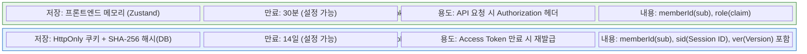
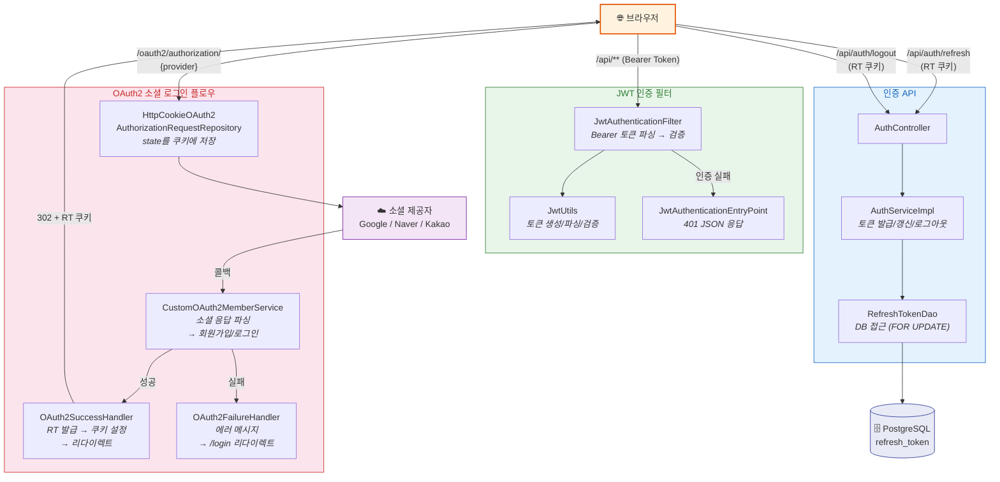
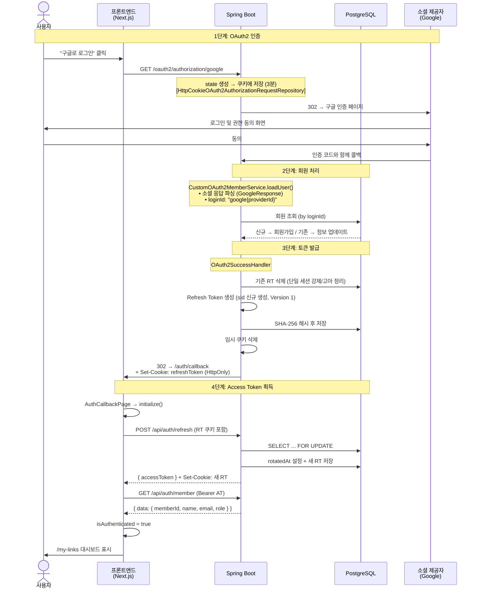
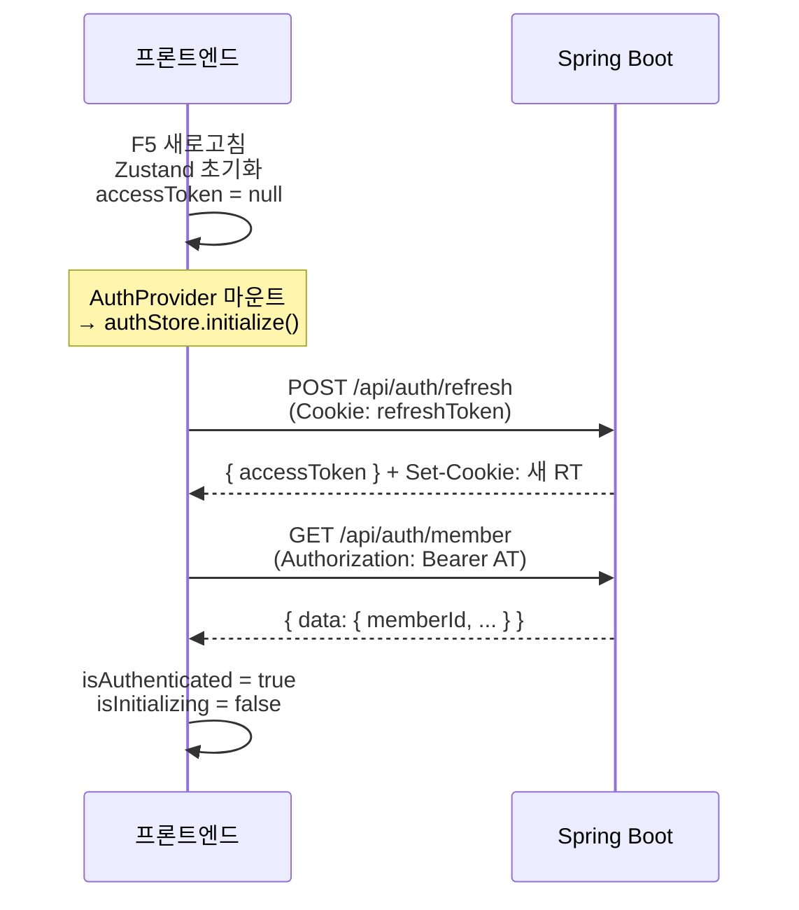
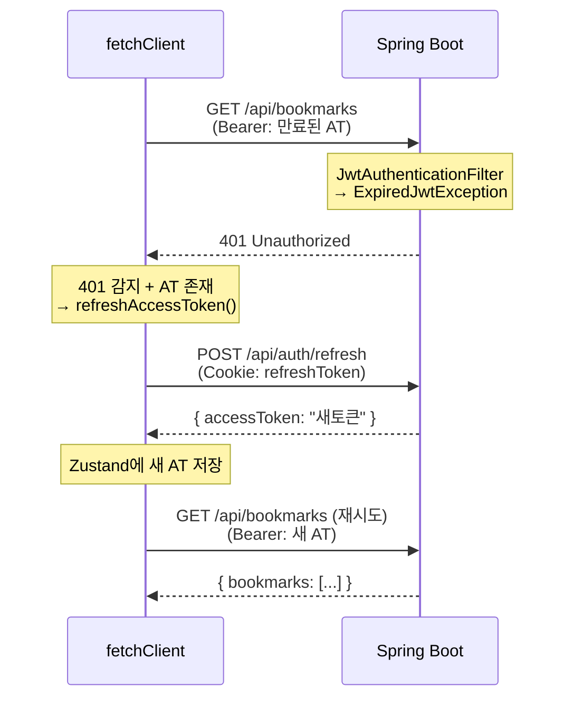
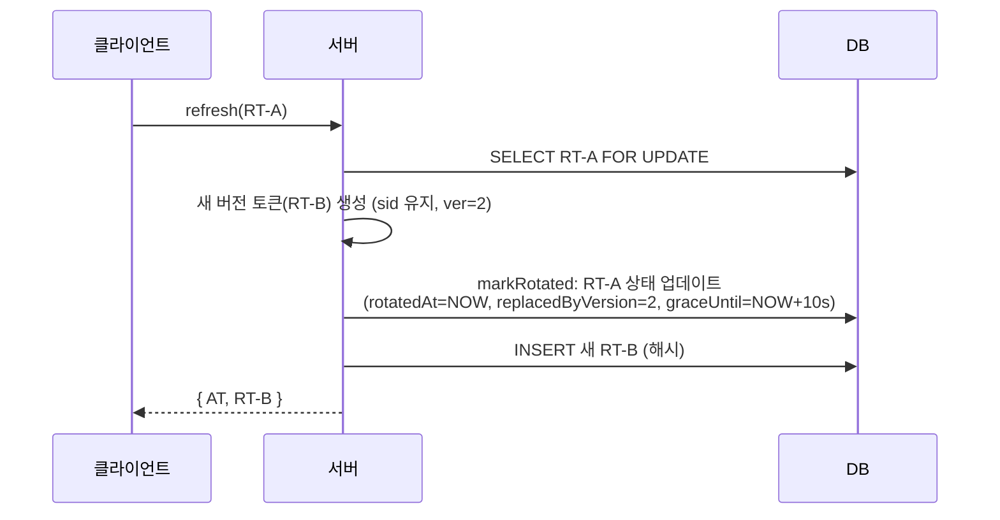
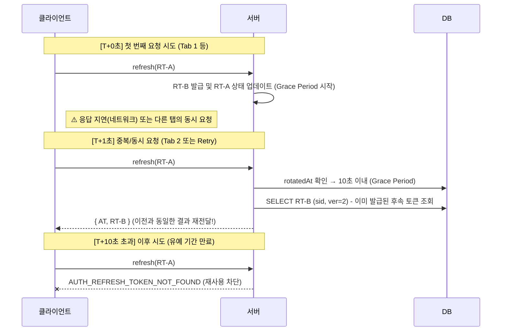
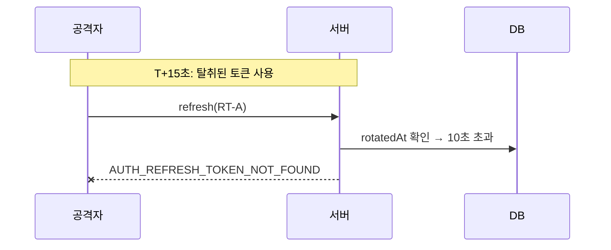
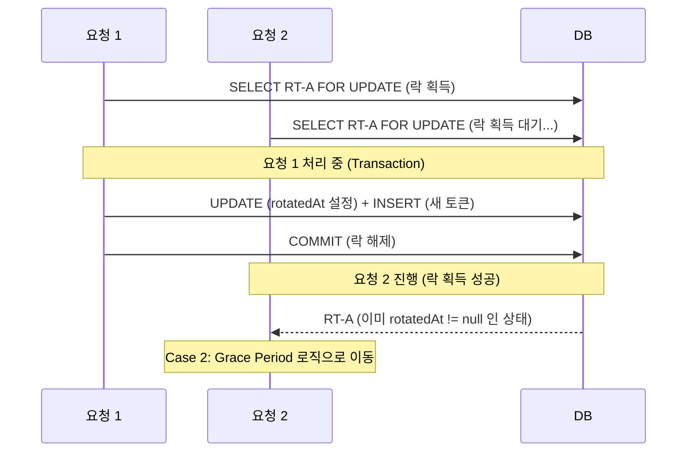
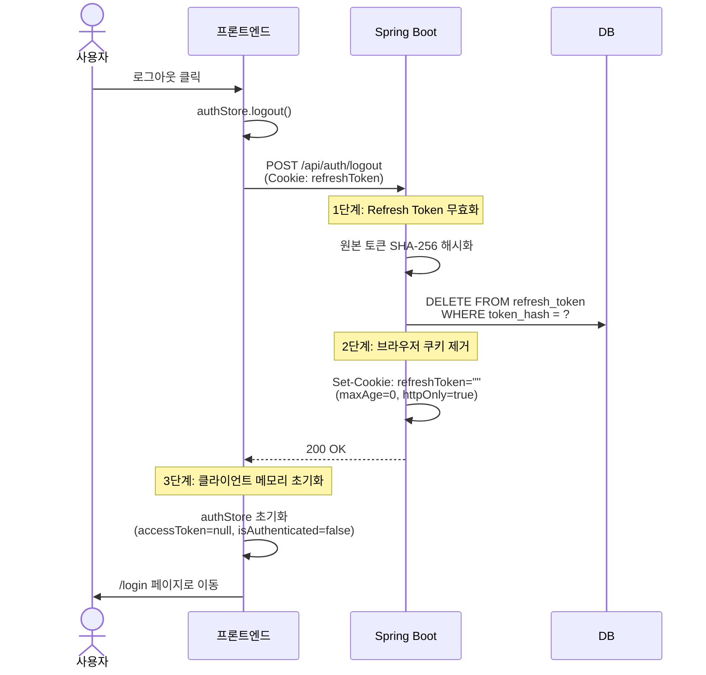

# JWT/OAuth2 소셜 로그인 아키텍처 가이드

> **브랜치**: `feat/SW-65`
> **대상**: 세션 기반 인증 → JWT + OAuth2 Stateless 아키텍처 전환
> **최종 수정**: 2026-03-22

---

## 목차

1. [전체 구조 한눈에 보기](#1-전체-구조-한눈에-보기)
2. [시나리오별 인증 플로우](#2-시나리오별-인증-플로우)
3. [백엔드 핵심 코드](#3-백엔드-핵심-코드)
4. [프론트엔드 핵심 코드](#4-프론트엔드-핵심-코드)
5. [보안 메커니즘](#5-보안-메커니즘)
6. [설정 파일 가이드](#6-설정-파일-가이드)
7. [파일 맵](#7-파일-맵)

---

## 1. 전체 구조 한눈에 보기

### 인증 방식 비교

| 항목 | 변경 전 (세션) | 변경 후 (JWT) |
|------|---------------|--------------|
| 인증 상태 저장 | 서버 세션 (메모리) | Access Token (클라이언트 메모리) |
| 세션 유지 | JSESSIONID 쿠키 | Refresh Token (HttpOnly 쿠키) |
| 로그인 방식 | 폼 로그인 + OAuth2 | **OAuth2 소셜 로그인만** |
| 서버 확장 | 세션 공유 필요 (Redis 등) | Stateless (제약 없음) |
| 로그아웃 | 세션 삭제 | DB에서 Refresh Token 삭제 |

### 토큰 구조



### 핵심 컴포넌트 관계도



---

## 2. 시나리오별 인증 플로우

### 시나리오 1: OAuth2 소셜 로그인 (최초 진입)

> 사용자가 "구글로 로그인" 버튼을 클릭하고, 인증 완료 후 대시보드로 이동하기까지의 전체 흐름



> 💡
> **백엔드 개발자를 위한 'OAuth2 리다이렉트' 심층 이해**
>
> **1. 왜 백엔드가 구글에 직접 요청하지 않고 브라우저를 이동시키나요?**
> - **보안(Security)**: 사용자의 구글 비밀번호가 우리 서버에 절대 노출되지 않도록 하기 위함입니다. 사용자는 오직 구글 서버와 직접 통신(브라우저를 통해)하여 본인을 인증합니다.
>
> **2. 브라우저 리다이렉트(302 Redirect)의 역할**
> - 우리 서버는 브라우저에게 `"302 Redirect"` 상태 코드와 함께 구글 로그인 주소를 보냅니다.
> - 브라우저는 이 명령을 받자마자 **자동으로 구글 로그인 페이지로 접속**합니다. (주소창이 구글로 바뀜)
> - 즉, 브라우저는 우리 서버와 구글 사이를 오가며 **사용자 본인임을 증명하는 통로** 역할을 합니다.
>
> **3. 코드(Code) vs 토큰(Token) 흐름 구분**
> - **사용자 브라우저 경로**: 로그인 과정에서 보안을 위해 일회용 **'코드(Authorization Code)'**만 전달받습니다. (보안 노출 위험 최소화)
> - **서버 대 서버(Server-to-Server) 경로**: 백엔드는 브라우저가 들고 온 코드를 가로채서, 구글 서버와 직접 통신하여 실제 **'토큰(Access Token)'**으로 교환합니다.
> - 결과적으로, 중요한 토큰과 사용자 개인정보는 브라우저를 거치지 않고 **구글 서버 ↔ 우리 서버** 사이에서만 안전하게 오고 가게 됩니다.

**핵심 포인트:**
- OAuth2 성공 시 **Access Token은 즉시 발급하지 않음** → Refresh Token만 쿠키에 설정
- 프론트엔드가 `/api/auth/refresh`를 호출하여 Access Token을 받아오는 구조
- 이유: OAuth2 리다이렉트 응답에서는 JSON body를 줄 수 없고, 쿠키나 URL 파라미터로만 전달 가능. Access Token을 URL에 노출하는 것은 보안 위험이므로 별도 요청으로 분리

---

### 시나리오 2: 페이지 새로고침 시 인증 복구

> 브라우저를 새로고침하면 Zustand 메모리가 초기화됨. Refresh Token 쿠키로 로그인 상태를 복구하는 과정



**핵심 포인트:**
- `AuthProvider`가 앱 최상위에서 `initialize()`를 호출
- `initializePromise` 싱글톤으로 중복 호출 방지 (AuthProvider + AuthCallbackPage 동시 마운트 대응)
- Refresh Token 쿠키가 없거나 만료되면 → `isAuthenticated = false` → `/login`으로 리다이렉트


> 💡
> **백엔드 개발자를 위한 '새로고침' 인증 복구 요약**
>
> **1. 핵심 이유 (왜 필요한가?)**
> - **백엔드**: Stateless 방식이라 서버 세션이 없습니다. (브라우저를 기억하지 않음)
> - **프론트엔드**: `Access Token`을 자바스크립트 변수(Zustand)에 담고 있는데, **새로고침(F5) 시 이 변수가 초기화**되어 증발합니다.
>
> **2. 해결 방법 (비상용 열쇠)**
> - 새로고침해도 사라지지 않는 **쿠키(HttpOnly Refresh Token)**를 활용합니다.
>
> **3. 인증 복구 흐름**
> 1. **F5 (새로고침)**: 프론트엔드 메모리가 비워짐 (`accessToken = null`).
> 2. **인증 복구 시작**: 앱이 켜지는 순간(`Mount`) 쿠키 속의 `Refresh Token`을 실어 백엔드에 갱신 요청을 보냅니다.
> 3. **백엔드 확인**: 백엔드가 쿠키를 검증하고 새로운 `Access Token`을 발급합니다.
> 4. **상태 복구**: 프론트엔드가 받은 토큰을 다시 메모리에 저장하여 로그인 상태를 유지합니다.
>
> **※ 참고 (마운트란?):** 리액트 컴포넌트 객체가 생성되어 실제 화면에 배치되는 시점으로, 스프링의 **`@PostConstruct`** 호출 타이밍과 유사합니다.

---

### 시나리오 3: API 요청 중 Access Token 만료

> Access Token이 만료된 상태에서 API를 호출하면 자동으로 갱신하고 재시도하는 과정



**핵심 포인트:**
- `fetchClient`가 **401을 자동 감지**하여 토큰 갱신 후 원래 요청을 재시도 (1회만)
- 여러 API가 동시에 401을 받으면 `refreshPromise` 공유로 갱신 요청 1회만 발생
- 갱신 실패(Refresh Token도 만료) → `authStore.logout()` → `/login` 이동

> 💡 **백엔드 개발자를 위한 프론트엔드 로직 상세 (`fetchClient.ts`)**
>
> 1. **401 감지 (`response.status === 401`)**: 
>    - 모든 API 요청은 공통 함수인 `fetchClient`를 통과합니다. 여기서 응답 코드가 401인지를 실시간으로 체크합니다.
> 2. **AT 존재 조건 (`&& accessToken`)**:
>    - "이미 AT를 가지고 있던 사용자(로그인했던 사용자)"인 경우에만 갱신을 시도합니다. 
>    - **이유**: 비로그인 사용자가 권한 없는 API에 접근했을 때 발생하는 401과 구분하여, 불필요한 무한 갱신 루프를 방지하기 위함입니다.
> 3. **투명한 재시도 (Transparent Retry)**:
>    - 사용자가 모르게 `POST /api/auth/refresh`를 먼저 호출해 토큰을 갈아 끼운 후, **실패했던 원래 API를 똑같은 파라미터로 다시 호출**합니다.
>    - 결과적으로 사용자는 끊김 없는 서비스를 경험하게 됩니다.
>
> - **관련 프론트 코드**: `frontend/src/lib/api/fetchClient.ts` 내의 `fetchClient` 함수와 `refreshAccessToken` 함수

---

### 시나리오 4: Refresh Token Rotation과 Grace Period

> 토큰 갱신 시 보안을 위해 기존 토큰을 무효화하고, 네트워크 지연에 대응하는 과정

#### Case 1: 정상 갱신



> 💡 **백엔드 로직 상세 (Case 1: 정상 갱신)**
> 1. **요청 (RT-A 제출)**: 클라이언트가 쿠키에 담긴 `RT-A`를 실어 `/api/auth/refresh`로 요청합니다.
> 2. **검증 및 락 (Lock 획득)**: JWT 유효성을 검토하고, DB에서 **비관적 락(`FOR UPDATE`)**으로 해당 토큰을 조회해 동시성(Race Condition) 문제를 방지합니다.
> 3. **판단 (`rotated_at == null`)**: DB 레코드의 `rotated_at`이 비어있으면 "최초 갱신 시도"인 정상 상황으로 판단합니다.
> 4. **회전 (Rotation)**: `RT-A`를 즉시 삭제하지 않고 `rotated_at`에 현재 시각을 기록하여 '사용됨' 도장을 찍습니다. (이때부터 10초간의 **Grace Period**가 시작됩니다.)
> 5. **발급 (RT-B 생성)**: 새로운 `Access Token`과 `Refresh Token(RT-B)`을 생성하고, `RT-B`를 DB에 새 로우로 삽입합니다.
> 6. **응답**: 새 토큰 쌍을 클라이언트에게 전달하며, 이후 클라이언트는 `RT-B`를 사용하게 됩니다.

#### Case 2: Grace Period 내 재사용 (동시 요청 또는 네트워크 지연)



> 💡 **백엔드 로직 상세 (Case 2: Grace Period 내 재사용)**
>
> **1. 상황 가정 (왜 발생하나요?)**
> - **멀티탭 동시 요청**: 사용자가 여러 탭을 열어둔 상태에서 토큰이 만료되면, 모든 탭이 **동시에** 갱신을 시도합니다. 비관적 락에 의해 순차 처리되더라도, 첫 번째 요청 이후의 나머지 요청들은 이미 '사용된 토큰'으로 들어오게 됩니다.
> - **네트워크 지연/유실**: 클라이언트가 요청을 보냈으나 응답 수신 직전 연결이 끊겨 즉시 재시도하는 경우입니다.
> - **기타**: 프론트엔드(`fetchClient`)가 결과 미수신 등으로 인해 똑같은 `RT-A`로 재시도 요청을 보내는 모든 경우를 포함합니다.
>
> **2. 백엔드의 판단 (Grace Period 로직)**
> - **조회/상태 확인**: "이미 한 번 갱신에 쓰였던(`rotated_at != null`) 토큰이네?"
> - **시간 계산**: "하지만 갱신된 지 겨우 3초(10초 이내)뿐이라 **정당한 재시도**로 확실시되네."
> - **코드 로직**: `if (rotatedAt.plusSeconds(10).isAfter(now))`
>
> **3. 처리 결과 (멱등성 보장 결과 재전달)**
> - **상태 유지**: Grace Period 내라면 횟수에 상관없이 동일한 `RT-B`를 받게 되어, 네트워크 불안정으로 인한 중복 요청 상황에서도 클라이언트가 안정적으로 최신 토큰을 확보할 수 있습니다.
> - **보안**: 유예 기간이 지나면 해당 토큰을 이용한 모든 요청은 거부됩니다. (이미 Successor가 발급된 상태이므로)
>
> **4. 만약 이 로직이 없다면?**
> - 지하철이나 엘리베이터 등 네트워크가 불안정한 환경에서 사용자가 시시때때로 로그아웃되어 로그인 페이지로 쫓겨나는 열악한 UX를 경험하게 됩니다.
>
> 💡 **멀티탭 환경에서의 멱등성 보장 (Seamless UX)**
> - 사용자가 한 브라우저에 여러 탭(예: 대시보드, 설정 페이지 등)을 열어놓은 채 토큰이 만료되면, 모든 탭이 **거의 동시에** 갱신을 시도합니다.
> - 최신 멱등성 로직은 가장 먼저 도착한 요청이 토큰을 회전시키더라도, 뒤이어 온 다른 탭의 요청들에 대해 **이미 발급된 동일한 새 토큰을 재전달**합니다.
> - 결과적으로 사용자는 어떤 탭에서도 로그인 끊김 없이 자연스러운 서비스를 이용할 수 있습니다.

#### Case 3: Grace Period 초과 (토큰 탈취 의심)



#### Case 4: 동시 요청 제어 (DB 비관적 락)



> 💡 **백엔드 로직 상세 (Case 4: 동시 요청 제어)**
> 
> **1. 동시성 문제의 발생**
> - 아주 찰나의 순간에 똑같은 `RT-A`로 두 개의 요청(R1, R2)이 들어올 때 발생합니다. (예: 멀티탭 환경에서 모든 탭이 동시에 갱신을 시도하는 경우)
> 
> **2. 비관적 락 (`FOR UPDATE`)의 역할**
> - **R1**: 먼저 DB 로우에 접근하여 **배타적 락(Exclusive Lock)**을 획득합니다.
> - **R2**: R1의 트랜잭션이 끝나기 전까지 동일한 로우에 대한 조회를 시도하며 **대기(Wait)** 상태에 빠집니다.
> 
> **3. 락 보호 아래의 안전한 갱신**
> - **R1의 작업**: 락을 쥐고 있는 상태에서 안전하게 `UPDATE`(기존 토큰 무효화)와 `INSERT`(신규 토큰 저장)를 수행한 후 커밋합니다.
> - **R2의 작업**: R1의 커밋이 종료되면 비로소 락을 얻고 조회를 완료합니다. 이때 이미 **`rotated_at`이 기록된 결과**를 받게 되므로, 자연스럽게 **Case 2(Grace Period 내 재사용)** 로직으로 분기되어 안전하게 처리됩니다.

---

**핵심 포인트:**
- **Rotation**: 매 갱신마다 새 Refresh Token 발급 → 탈취된 토큰의 유효 시간 최소화
- **Grace Period (10초)**: 네트워크 지연으로 인한 정당한 중복 요청 허용 (유예 기간 내 횟수 제한 없음)
- **FOR UPDATE**: DB 수준 비관적 락으로 동시 갱신 요청의 경합 조건 방지

---

### 시나리오 5: 로그아웃

> 사용자가 로그아웃 버튼을 클릭하여 서버와 클라이언트 모두에서 인증 정보를 제거하는 과정



> 💡
> **백엔드 개발자를 위한 '로그아웃' 처리 요약**
>
> **1. 핵심 이유 (왜 이렇게 처리하는가?)**
> - **Stateless 인증**: 서버는 클라이언트의 상태를 기억하지 않으므로, 더 이상 유효하지 않은 `Refresh Token`을 서버 DB(무효화 목록)에서 명시적으로 삭제해야 합니다.
> - **보안 강화**: 브라우저에 남은 `HttpOnly` 쿠키를 강제로 만료(`Max-Age=0`)시켜 클라이언트 측의 접근 권한도 즉시 회수합니다.
>
> **2. 백엔드 처리 상세 (`AuthController.java`)**
> - **쿠키 추출**: `@CookieValue`를 통해 브라우저가 보낸 `refreshToken`을 읽습니다.
> - **DB 삭제**: 해당 토큰을 해시화하여 DB에서 삭제(`deleteByTokenHash`)합니다. 이제 이 토큰으로는 더 이상 Access Token을 갱신할 수 없습니다.
> - **쿠키 만료**: 응답 헤더에 `Set-Cookie`를 빈 값(`""`)과 `maxAge(0)`으로 설정하여 브라우저가 쿠키를 삭제하도록 명령합니다.
>
> **3. 프론트엔드와의 협업**
> - **메모리 삭제**: 프론트엔드는 자바스크립트 변수(`accessToken`)에 담긴 인증 정보를 지워야 합니다. 
> - **강제 진행**: 네트워크 오류 등으로 서버 요청이 실패하더라도, 사용자가 로그아웃을 눌렀다면 클라이언트 상태는 무조건 초기화하여 보안 사고를 예방합니다 (`finally` 블록 활용).

**핵심 포인트:**
- **서버/네트워크 오류 대응**: 서버 응답과 무관하게(또는 실패하더라도) 클라이언트 상태는 반드시 초기화하여 보안 유지
- **DB 무효화**: DB에서 `Refresh Token`을 삭제하여, 이후 해당 토큰이 탈취되더라도 Access Token 발급 시도 원천 차단
- **쿠키 제거**: `HttpOnly` 쿠키는 자바스크립트가 지울 수 없으므로, 반드시 서버가 `maxAge=0` 응답을 주어야 함

---

## 3. 백엔드 핵심 코드

### 3.1 SecurityConfig — 필터 체인 설정

> `config/security/SecurityConfig.java`

Spring Security의 전체 보안 규칙을 정의하는 핵심 설정 클래스.

```
필터 체인 순서:
  JwtAuthenticationFilter → UsernamePasswordAuthenticationFilter → ... → AuthorizationFilter
  ↑ (우리가 추가한 필터)
```

**주요 설정:**

| 설정 | 값 | 이유 |
|------|---|------|
| CSRF | 비활성화 | JWT Bearer 토큰 방식은 CSRF 공격 대상 아님 |
| 세션 | STATELESS | JWT 사용, 서버 메모리 점유 안 함 |
| 폼 로그인 | 비활성화 | 소셜 로그인만 사용 |
| `/api/auth/refresh`, `/api/auth/logout` | permitAll | 토큰 없이 접근 필요 |
| `/api/**` | authenticated | 그 외 모든 API 인증 필수 |

---

### 3.2 JwtAuthenticationFilter — 매 요청마다 토큰 검증

> `config/jwt/JwtAuthenticationFilter.java`

모든 HTTP 요청을 가로채서 JWT를 검증하는 필터. `OncePerRequestFilter` 상속으로 요청당 1회만 실행.

**동작 방식:**
1. `Authorization: Bearer {token}` 헤더에서 토큰 추출
2. 토큰이 없으면 → 필터 통과 (공개 API는 접근 가능)
3. 토큰이 있으면 → `JwtUtils.validateToken()` 검증
4. 유효하면 → `JwtMemberPrincipal` 생성 후 `SecurityContext`에 저장
5. 만료/위변조 → request attribute에 에러 코드 저장, 필터 통과
6. 이후 `JwtAuthenticationEntryPoint`가 에러 코드를 읽어 401 JSON 응답

**왜 예외를 던지지 않고 attribute에 저장하는가?**
- 필터에서 예외를 던지면 Spring Security의 ExceptionTranslationFilter가 처리
- 세밀한 에러 메시지(만료 vs 위변조)를 전달하기 위해 attribute 방식 사용

---

### 3.3 JwtUtils — 토큰 생성과 검증

> `config/jwt/JwtUtils.java`

JWT 토큰의 생성, 파싱, 검증을 담당하는 유틸리티 클래스.

| 메서드 | 역할 |
|--------|------|
| `generateAccessToken(memberId, role)` | Access Token 생성 (sub: memberId, claim: role, id: random) |
| `generateRefreshToken(memberId, sid, ver, iat, exp)` | Refresh Token 생성 (sid, ver 메타데이터 포함, id: sid:ver) |
| `parseAccessToken(token)` | 토큰 파싱 → `JwtMemberPrincipal(memberId, role)` 반환 |
| `validateToken(token)` | 서명 + 만료 검증. 실패 시 예외 throw (void 반환) |
| `extractMemberId(token)` | 토큰에서 memberId 추출 |

**결정적 토큰 생성 (Deterministic Token Generation):**
- 리프레시 토큰 생성 시 랜덤 요소(UUID)를 배제하고 `sid`, `ver`, `iat`, `exp`를 조합하여 생성합니다.
- 이는 서버가 DB에 저장된 메타데이터만으로 **동일한 토큰 값을 재현**할 수 있게 하여, 멱등성 응답을 보장하는 기술적 토대가 됩니다.

**서명 알고리즘:** HMAC-SHA256 (대칭키, `jwt.secret` 프로퍼티에서 주입)

---

### 3.4 AuthController — 인증 API 엔드포인트

> `auth/controller/AuthController.java`

| 엔드포인트 | 메서드 | 인증 | 역할 |
|-----------|--------|------|------|
| `POST /api/auth/refresh` | `refresh()` | 불필요 | Refresh Token으로 새 토큰 쌍 발급 |
| `POST /api/auth/logout` | `logout()` | 불필요 | 토큰 삭제 + 쿠키 제거 |
| `GET /api/auth/member` | `getAuthenticatedMemberInfo()` | **필요** | 현재 사용자 정보 반환 |

**Refresh Token 쿠키 설정:**
```
httpOnly=true       ← JavaScript 접근 차단 (XSS 방어)
secure={프로필별}    ← local: false, prod: true (HTTPS 전용)
sameSite=Lax        ← 외부 사이트에서의 쿠키 전송 제한 (CSRF 방어)
path=/api/auth      ← 이 경로의 요청에만 쿠키 포함 (노출 최소화)
maxAge={14일}        ← Refresh Token 만료와 동일
```

---

### 3.5 AuthServiceImpl — 토큰 비즈니스 로직

> `auth/service/AuthServiceImpl.java`

**`refresh()` 메서드 — 핵심 로직 상세:**

```java
// 1. JWT 자체 검증 (서명, 만료)
jwtUtils.validateToken(refreshToken);

// 2. DB에서 해시로 조회 (비관적 락으로 동시성 제어)
String hashedToken = SecurityUtils.hashToken(refreshToken);
RefreshToken storedRefreshToken = refreshTokenDao.findByTokenHashForUpdate(hashedToken);

// 3. DB 만료 확인
if (storedRefreshToken.getExpiresAt().isBefore(Instant.now())) { /* 삭제 후 에러 */ }

// 4. 로테이션 이력 확인 (Grace Period 처리)
if (storedRefreshToken.getReplacedByVersion() != null) {
    if (storedRefreshToken.getGraceUntil() != null && !storedRefreshToken.getGraceUntil().isBefore(now)) {
        // [분기 A] 유예 기간 내 재사용 -> 기존 발급된 후속 토큰(Successor) 재전달
        return buildTokenPair(refreshTokenDao.findBySessionIdAndVersion(sid, replacedByVersion));
    }
    // 유예 기간 초과 -> 에러 (탈취 의심)
    throw AuthException.of(AuthErrorCode.AUTH_REFRESH_TOKEN_NOT_FOUND);
}

// 5. [분기 B] 처음 수행되는 정상 로테이션
// 새 버전의 후속 토큰 생성 (sid 유지, version + 1)
RefreshToken successor = createAndSaveRefreshToken(memberId, sessionId, currentVersion + 1);

// 부모 토큰 상태를 '회전됨'으로 업데이트 (replacedByVersion, graceUntil 설정)
refreshTokenDao.markRotated(parentTokenWithMetadata);

return buildTokenPair(successor);
```

**`issueRefreshToken()` 메서드 — OAuth2 로그인 후 호출:**
1. 기존 회원의 모든 Refresh Token 삭제 (고아 토큰 정리)
2. 새 Refresh Token 생성
3. SHA-256 해시 후 DB 저장
4. 원본 토큰 반환 (쿠키에 저장될 값)

---

### 3.6 OAuth2 로그인 처리 클래스

#### CustomOAuth2MemberService — 소셜 응답 파싱 및 회원 처리

> `member/service/CustomOAuth2MemberService.java`

Spring Security의 `DefaultOAuth2UserService`를 확장. 소셜 제공자에서 사용자 정보를 받아온 후 호출됨.

**처리 흐름:**
1. `registrationId`로 소셜 제공자 판별 (naver / google / kakao)
2. 제공자별 `OAuth2Response` 구현체 생성 (각 API 응답 포맷 파싱)
3. 회원 고유 ID 생성: `{provider}{providerId}` (예: `google123456789`)
4. DB 조회 → 신규면 회원가입, 기존이면 정보 업데이트
5. `CustomOAuth2Member` 반환 (Spring Security의 Principal로 사용)

#### OAuth2SuccessHandler — 로그인 성공 후 처리

> `config/jwt/OAuth2SuccessHandler.java`

1. `CustomOAuth2Member`에서 `memberId` 추출
2. `AuthService.issueRefreshToken()` 호출
3. Refresh Token을 HttpOnly 쿠키에 설정
4. `redirect_uri` 쿠키 검증 (`isAuthorizedRedirectUri` — 스킴+호스트+포트 3중 비교)
5. 임시 OAuth2 쿠키 삭제
6. 프론트엔드 `/auth/callback`으로 리다이렉트

#### HttpCookieOAuth2AuthorizationRequestRepository — STATELESS + OAuth2 호환

> `config/security/HttpCookieOAuth2AuthorizationRequestRepository.java`

**왜 필요한가?**
- OAuth2 Authorization Code 플로우는 `state` 파라미터를 저장해야 함 (CSRF 방지)
- 기본 구현(`HttpSessionOAuth2AuthorizationRequestRepository`)은 서버 세션에 저장
- STATELESS 정책에서는 세션이 없으므로 **쿠키에 저장하는 커스텀 구현**이 필요

| 시점 | 메서드 | 역할 |
|------|--------|------|
| 소셜 로그인 시작 | `saveAuthorizationRequest()` | 인증 요청 정보를 쿠키에 직렬화하여 저장 (3분 만료) |
| 소셜 인증 콜백 | `loadAuthorizationRequest()` | 쿠키에서 인증 요청 정보를 역직렬화하여 반환 |
| 인증 완료 후 | `removeAuthorizationRequestCookies()` | 임시 쿠키 삭제 |

---

### 3.7 에러 처리

#### AuthErrorCode — 인증 도메인 에러 코드

> `auth/error/AuthErrorCode.java`

| 코드 | HTTP 상태 | 설명 |
|------|-----------|------|
| `AUTH_UNAUTHORIZED` | 401 | 인증이 필요한 요청 |
| `AUTH_TOKEN_EXPIRED` | 401 | Access/Refresh Token 만료 |
| `AUTH_INVALID_TOKEN` | 401 | 토큰 위변조 또는 파싱 실패 |
| `AUTH_REFRESH_TOKEN_NOT_FOUND` | 401 | DB에 Refresh Token 없음 |
| `AUTH_ACCESS_DENIED` | 403 | 접근 권한 없음 |
| `AUTH_INVALID_REDIRECT_URI` | 400 | 허용되지 않은 리다이렉트 URI |
| `AUTH_UNSUPPORTED_PROVIDER` | 400 | 지원하지 않는 소셜 제공자 |

#### JwtAuthenticationEntryPoint — 인증 실패 JSON 응답

> `config/jwt/JwtAuthenticationEntryPoint.java`

`JwtAuthenticationFilter`가 request attribute에 저장한 에러 코드를 읽어서 JSON 응답:
```json
{ "code": "A002", "message": "토큰이 만료되었습니다.", "success": false }
```

---

## 4. 프론트엔드 핵심 코드

### 4.1 authStore.ts — 전역 인증 상태 (Zustand)

> `frontend/src/lib/store/authStore.ts`

| 상태 | 타입 | 설명 |
|------|------|------|
| `accessToken` | `string \| null` | API 인증용 토큰 (메모리에만 존재) |
| `isAuthenticated` | `boolean` | 로그인 여부 |
| `isInitializing` | `boolean` | 초기화 진행 여부 (로딩 표시용) |
| `member` | `Member \| null` | 사용자 프로필 정보 |
| `authError` | `string \| null` | 서버/네트워크 오류 메시지 |

| 액션 | 역할 |
|------|------|
| `initialize()` | `/api/auth/refresh` → `/api/auth/member` 순서로 호출하여 로그인 상태 복구 |
| `logout()` | `/api/auth/logout` 호출 후 상태 초기화 |
| `setAccessToken(token)` | 토큰 갱신 시 새 토큰 저장 |

**`initializePromise` 패턴:**
```typescript
let initializePromise: Promise<void> | null = null;

// AuthProvider와 AuthCallbackPage가 동시에 initialize() 호출해도
// 실제 API 요청은 1회만 발생
initialize: async () => {
  if (initializePromise) return initializePromise;
  initializePromise = (async () => { /* ... */ })();
  return initializePromise;
}
```

---

### 4.2 fetchClient.ts — API 클라이언트

> `frontend/src/lib/api/fetchClient.ts`

모든 API 호출을 감싸는 래퍼. 인증 토큰 주입과 자동 갱신을 담당.

**핵심 기능:**

1. **자동 토큰 주입**: `Authorization: Bearer {accessToken}` 헤더 추가
2. **401 자동 갱신**: 만료 시 `/api/auth/refresh` 호출 후 원래 요청 재시도 (1회)
3. **동시 갱신 방지**: `refreshPromise` 공유로 여러 401이 동시에 발생해도 갱신 1회
4. **갱신 실패 시 로그아웃**: `authStore.logout()` → `/login` 이동

```
요청 ──→ 성공(200) ──→ 응답 반환
  │
  └──→ 실패(401) ──→ refreshAccessToken() ──┬──→ 성공 ──→ 원래 요청 재시도
                                           │
                                           └──→ 실패 ──→ logout() → /login
```

---

### 4.3 AuthProvider.tsx — 인증 초기화 및 라우트 가드

> `frontend/src/components/providers/AuthProvider.tsx`

앱 최상위에서 인증 상태를 초기화하고, 미인증 사용자의 접근을 제어.

**역할:**
1. 앱 시작 시 `authStore.initialize()` 호출 (1회)
2. 초기화 중 → 로딩 스피너 표시
3. 초기화 완료 후:
   - 미인증 + 보호 경로 → `/login` 리다이렉트
   - 인증 완료 → 자식 컴포넌트 렌더링

**공개 경로:** `/`, `/login`, `/auth/callback` (접두사 매칭)

---

### 4.4 AuthCallbackPage — OAuth2 콜백 처리

> `frontend/src/app/auth/callback/page.tsx`

OAuth2 인증 완료 후 Spring Boot가 리다이렉트하는 페이지.

**동작:**
1. 마운트 시 `authStore.initialize()` 호출 (`useRef`로 중복 방지)
2. `initializePromise` 싱글톤으로 AuthProvider와의 이중 호출 방지
3. 인증 성공 → `/my-links` 이동
4. 인증 실패 → `/login` 이동

---

## 5. 보안 메커니즘

### 토큰 저장 전략

| 토큰 | 저장 위치 | 접근 가능 | XSS 노출 | CSRF 노출 |
|------|----------|----------|---------|---------|
| Access Token | Zustand (메모리) | JavaScript | O (단, 새로고침 시 소멸) | X |
| Refresh Token | HttpOnly 쿠키 | 서버만 | X | △ (SameSite=Lax로 완화) |
| Refresh Token 해시 | PostgreSQL DB | 서버만 | X | X |

### 공격 방어 매트릭스

| 공격 유형 | 방어 수단 |
|----------|----------|
| **XSS** | Refresh Token: HttpOnly 쿠키 (JS 접근 불가). Access Token: 메모리 저장 (localStorage보다 안전) |
| **CSRF** | SameSite=Lax 쿠키 + Bearer 토큰 방식 (쿠키가 자동 전송되지 않는 구조) |
| **토큰 탈취** | Rotation (매번 새 토큰) + Grace Period (멱등성 재전달) + Session/Version 추적 (복제 감지) |
| **DB 유출** | SHA-256 해시 저장 (원본 토큰 복합 키: [해시, sid, ver] 등으로 추적 가능) |
| **동시 요청 공격** | SELECT ... FOR UPDATE 비관적 락 + @Transactional |
| **Open Redirect** | OAuth2 redirect_uri 검증 (스킴+호스트+포트 3중 비교) |
| **세션 고정** | STATELESS (세션 자체가 없음) |
| **OAuth2 CSRF** | state 파라미터 쿠키 저장 + 콜백 시 검증 |
| **멀티 디바이스 보호** | 현재 단일 세션 강제 (Login 시 기존 RT 전체 삭제). 향후 최대 세션 수 제한(FIFO) 방식으로 확장 가능. |

---

### 5.3 멱등성(Idempotency) 보장 메커니즘 상세

네트워크 장애나 클라이언트의 중복 요청(멀티탭 등)에도 시스템이 일관된 응답을 제공하는 핵심 원리입니다.

#### 1단계: 비관적 락을 통한 상호 배제
`SELECT ... FOR UPDATE`를 사용하여 동일한 토큰에 대한 여러 요청 중 단 하나만 트랜잭션을 진행하도록 보장합니다.

#### 2단계: 결정적 토큰 생성 (Deterministic Generation)
랜덤 값이 아닌 고정된 세션 정보(`sid`)와 순차적 버전(`ver`)을 기반으로 JWT를 생성합니다. 이를 통해 서버는 이미 발급된 토큰이라도 DB에 기록된 메타데이터를 사용하여 **정확히 동일한 토큰 문자열**을 얻을 수 있습니다.

#### 3단계: 유예 기간(Grace Period) 내 결과 재전달
이미 회전된(`replaced_by_version != null`) 토큰으로 요청이 들어오면:
1. 설정된 유예 기간(10초) 이내인지 확인합니다.
2. 기간 내라면 DB에서 해당 세션의 다음 버전(`replaced_by_version`) 토큰을 찾아 **새로 생성하지 않고 그대로 반환**합니다.
3. 클라이언트는 지연된 첫 번째 요청의 결과든, 재시도한 두 번째 요청의 결과든 동일한 최신 토큰을 받게 되어 인증 흐름이 중단되지 않습니다.

> **📝 향후 확장 고려사항: 멀티 디바이스 로그인 정책**
>
> **1. 현재 동작 (보안 우선 단일 세션)**
> - 사용자가 소셜 로그인 시, `AuthServiceImpl.issueRefreshToken`에서 `refreshTokenDao.deleteByMemberId(memberId)`를 호출하여 **해당 사용자의 기존 모든 Refresh Token을 즉시 무효화**합니다.
> - 이는 고아 토큰(사용되지 않는 토큰)의 누적을 방지하고, 타 기기에서의 부정 사용 가능성을 원천 차단하는 가장 안전한 방식입니다.
>
> **2. 향후 확장: 멀티 디바이스 지원 (최대 세션 수 제한)**
> - PC, 모바일, 태블릿 등 여러 환경에서 동시 로그인을 유지하려면 다음과 같은 개편이 필요합니다.
>   - **세션 카운팅**: 전체 삭제 대신 사용자의 현재 유효 세션 수를 확인합니다.
>   - **FIFO 삭제**: 설정된 상한선(예: 3~5개)을 초과할 때만 가장 오래된(또는 만료 시점이 가장 빠른) 세션을 삭제합니다.
>   - **기기 식별**: `User-Agent` 등을 이용해 기기별 정보를 기록하면 사용자가 설정에서 기기를 직접 관리(선택적 로그아웃)할 수도 있습니다.
>

---

## 6. 설정 파일 가이드

### 환경변수 (필수)

| 변수명 | 설명 | 예시 |
|--------|------|------|
| `JWT_SECRET` | JWT 서명 비밀키 (Base64, 256bit 이상) | `dGhpcyBpcyBhIHNlY3JldCBrZXkgZm9yIGp3dA==` |
| `JWT_ACCESS_TOKEN_EXPIRY` | Access Token 만료 (ms) | `1800000` (30분) |
| `JWT_REFRESH_TOKEN_EXPIRY` | Refresh Token 만료 (ms) | `1209600000` (14일) |

### 프로필별 설정 차이

| 설정 | local | dev | prod |
|------|-------|-----|------|
| `app.cookie.secure` | `false` | `${DEV_COOKIE_SECURE:false}` | `${PROD_COOKIE_SECURE:true}` |
| `app.oauth2.redirect-uri` | `http://localhost:3000/auth/callback` | 환경변수 | 환경변수 |

---

## 7. 파일 맵

### 읽는 순서 추천

> 처음 코드를 파악할 때는 아래 순서로 읽으면 흐름이 자연스럽습니다.

**1단계: 설정과 진입점** (전체 구조 파악)
```
config/security/SecurityConfig.java          ← 필터 체인, URL 접근 규칙, OAuth2 설정
config/jwt/JwtProperties.java                ← JWT 설정값 (secret, expiry, path)
```

**2단계: JWT 인증 흐름** (매 요청마다 실행)
```
config/jwt/JwtAuthenticationFilter.java      ← 요청 가로채기 → 토큰 검증
config/jwt/JwtUtils.java                     ← 토큰 생성, 파싱, 검증 로직
config/jwt/JwtMemberPrincipal.java           ← 토큰에서 추출한 사용자 정보
config/jwt/JwtAuthenticationEntryPoint.java  ← 인증 실패 시 JSON 응답
```

**3단계: OAuth2 소셜 로그인** (로그인 시 1회 실행)
```
member/service/CustomOAuth2MemberService.java         ← 소셜 응답 파싱 → 회원가입/로그인
member/dto/CustomOAuth2Member.java                     ← OAuth2 Principal 구현체
member/dto/Response/OAuth2Response.java                ← 소셜 제공자별 응답 인터페이스
config/jwt/OAuth2SuccessHandler.java                   ← 성공: 토큰 발급 + 리다이렉트
config/jwt/OAuth2FailureHandler.java                   ← 실패: 에러 메시지 + 리다이렉트
config/security/HttpCookieOAuth2AuthorizationRequestRepository.java  ← STATELESS + OAuth2 호환
config/security/CookieUtils.java                       ← 쿠키 직렬화/역직렬화 유틸
```

**4단계: 토큰 관리 비즈니스 로직**
```
auth/controller/AuthController.java          ← API 엔드포인트 (refresh, logout, member)
auth/service/AuthServiceImpl.java            ← 핵심 로직 (토큰 발급, 갱신, Grace Period)
auth/dao/RefreshTokenDao.java                ← DB 접근 인터페이스
auth/domain/RefreshToken.java                ← 토큰 엔티티
auth/error/AuthErrorCode.java                ← 에러 코드 정의
config/security/SecurityUtils.java           ← 사용자 ID 추출, 토큰 해싱 유틸
```

**5단계: 프론트엔드 인증**
```
frontend/src/lib/store/authStore.ts              ← 전역 인증 상태 (Zustand)
frontend/src/lib/api/fetchClient.ts              ← API 클라이언트 (자동 토큰 갱신)
frontend/src/components/providers/AuthProvider.tsx ← 인증 초기화 + 라우트 가드
frontend/src/app/auth/callback/page.tsx           ← OAuth2 콜백 처리 페이지
```

**6단계: DB/설정**
```
resources/mapper/refresh-token-mapper.xml         ← MyBatis SQL (CRUD + FOR UPDATE)
resources/sql/V001__create_refresh_token.sql      ← Flyway 마이그레이션
resources/application-{profile}.properties        ← 프로필별 설정
```
