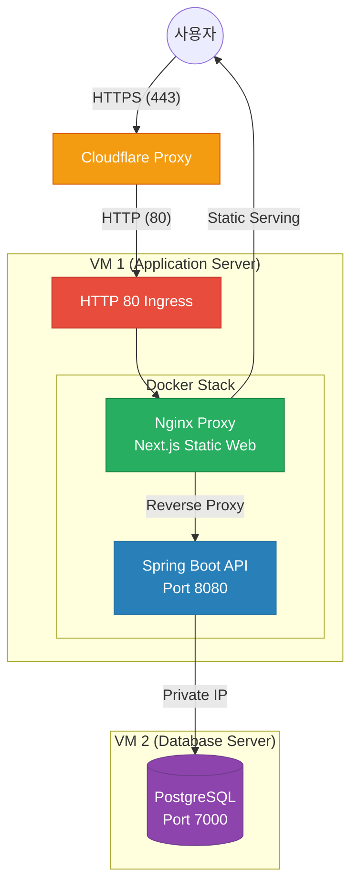

# 🌐 Relink 인프라 & 배포 아키텍처 가이드

본 문서는 **Relink** 서비스의 2-Tier 운영 인프라 아키텍처와 네트워크 데이터 흐름을 핵심만 간결하게 설명합니다.

---

## 1. 아키텍처 개요 (High-Level Topology)
현재 리소스 제약(각 VM 1GB RAM) 하에서 가장 가볍고 안정적인 **2-VM 기반 3-Tier 아키텍처(웹/앱 서버와 데이터베이스 서버 분리) 구조**를 채택하고 있습니다.

*   **VM 1 (Web / Application Server)**: Nginx (Reverse Proxy & Next.js 정적 서빙) + Spring Boot API
*   **VM 2 (Database Server)**: PostgreSQL 16 (인터넷 망 분리)

---

## 2. 네트워크 & 데이터 흐름 (Data Flow)

### 2.1 실제 데이터 흐름 시나리오
1. **사용자 ➡️ Cloudflare**: 사용자는 안전한 **HTTPS(443)** 포트로 도메인을 통해 Cloudflare Proxy 서버에 접속합니다.
2. **Cloudflare ➡️ VM 1 (HTTP 80 Ingress)**: Cloudflare는 전달받은 암호화 트래픽을 복호화(Flexible SSL 모드)한 후, 본 서버인 VM 1의 **HTTP(80)** 포트로 요청을 보냅니다.
3. **VM 1 방화벽 통과**: 이 요청이 VM 1의 가상 네트워크(VCN) 보안 규칙 및 OS 방화벽에 정의된 **HTTP 80 Ingress** 허용 목록을 통과하여 비로소 서버 내부로 진입하게 됩니다.
4. **VM 1 (Nginx Proxy)**: 유입된 요청을 Nginx가 식별하여 다이렉트 처리 혹은 포워딩을 수행합니다.
   * **정적 리소스**: Next.js 정적 페이지 파일(HTML/JS/CSS 등)을 즉시 **사용자에게 직접 반환(서빙)**합니다.
   * **API / OAuth 요청**: `/api`, `/oauth2`, `/login/oauth2` 경로의 요청을 내부 Docker 네트워크망을 통해 **Spring Boot(8080)**로 리버스 프록시(전달)합니다.
5. **VM 1 ➡️ VM 2 (PostgreSQL)**: Spring Boot가 비즈니스 로직을 처리하는 과정에서, 사설 네트워크 대역을 안전하게 경유하여 VM 2의 **PostgreSQL(7000)**에 쿼리를 수행하고 데이터를 반환받아 최종 응답을 빌드합니다.

---

## 3. 구성 요소 핵심 역할 및 포트 설계

### 3.1 VM 1 (Web / Application Server)
*   **역할**: 웹 프론트엔드 정적 파일 서빙, API 요청 라우팅, 백엔드 비즈니스 로직 구동
*   **주요 포트 설정**:
    *   **HTTP (80)**: 외부 오픈 (Cloudflare Proxy 유입 처리)
    *   **HTTPS (443)**: Cloudflare 측에서 HTTPS 종단 처리(Flexible 모드)를 수행하므로 VM에서는 직접 다루지 않고 80 포트로 포워딩받음
    *   **SSH (22)**: 보안상 관리자 지정 IP에서만 접근 허용
    *   **8080 (Spring API)**: Docker 내부망을 통해서만 Nginx와 통신 (외부 직접 노출 차단)

### 3.2 VM 2 (Database Server)
*   **역할**: 회원 데이터, 링크 메타데이터 등 중요 영속성 데이터 저장 및 격리
*   **주요 포트 설정**:
    *   **PostgreSQL (7000)**: VM 1의 **Private IP** 대역에서만 접근이 가능하도록 방화벽 및 OCI 보안 규칙 설정 (인터넷 상의 다이렉트 접근 완전 봉쇄)
    *   **SSH (22)**: 관리자 지정 IP에서만 접근 허용

---

## 4. 인프라 운영 핵심 체크포인트 (521 에러 및 통신 문제 대응)

> [!IMPORTANT]
> **네트워크 통신 불통 및 521(Web Server is Down) 에러 발생 시 최우선 확인 리스트:**
> 1. **Cloudflare SSL/TLS 설정**: 반드시 **Flexible** 모드로 세팅되어 있어야 합니다. (Full/Strict 모드 사용 시 VM 1 측의 443 포트 및 인증서 부재로 521 에러 유발)
> 2. **OCI VCN (가상 클라우드 네트워크) 수신 규칙**:
>    *   **VM 1**: 80 포트(TCP)가 모든 대역(`0.0.0.0/0`) 혹은 Cloudflare IP 대역에 열려 있는지 확인
>    *   **VM 2**: 7000 포트(TCP)가 VM 1의 Private IP 기준으로 열려 있는지 확인
> 3. **서버 내부 Docker 상태**:
>    *   `sudo docker ps` 명령어로 `relink-nginx` 및 `relink-backend` 컨테이너가 정상 기동(Up) 중인지 확인
