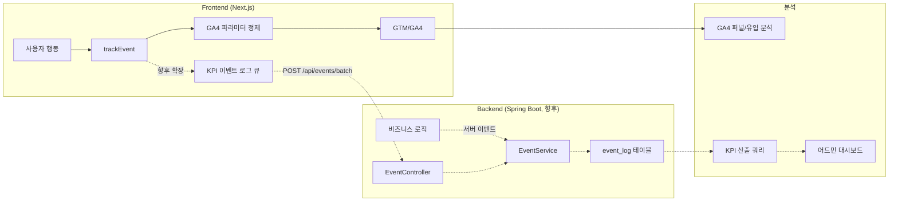

# SearchWeb KPI 측정 설계

> **문서 정보**
> - **버전:** v1.0.0
> - **작성일:** 2026-02-22
> - **근거 문서:** [searchweb_PRD.md](file:///e:/01.%20spring_projcet/SearchWeb/docs/Plan/searchweb_PRD.md)
> - **문서 목적:** PRD에 정의된 KPI를 실제로 측정하기 위한 이벤트 로그 수집/산출 체계 설계

<br>

## 1. 개요

SearchWeb PRD에서 정의된 5개 KPI 카테고리의 **목표 수치를 실제로 측정**하려면, 사용자 행동을 이벤트 단위로 수집하고 이를 기반으로 KPI를 산출하는 체계가 필요하다.

본 문서는 아래 3가지를 설계한다:
1. **수집** — 어떤 이벤트를 어디서(프론트엔드/백엔드) 수집할 것인가
2. **저장** — 수집된 이벤트를 어떤 스키마에 저장할 것인가
3. **산출** — 저장된 데이터를 어떻게 집계하여 KPI를 산출할 것인가

<br>

## 2. PRD KPI 요약 (측정 대상)

| 카테고리 | KPI | 목표 |
| :--- | :--- | :--- |
| ① 재사용 발생 | 저장 후 7일 내 재사용 사용자 비율 | ≥ 20% |
| | 탐색 기반 재사용 비율 (검색/태그/폴더 → 재열기) | ≥ 30% |
| | 사용자당 평균 주간 검색 횟수 | ≥ 1회 |
| ② 정리 효율 | AI 태그 포함 링크 비율 | ≥ 60% |
| | AI 추천 태그 채택률 | ≥ 50% |
| | 수동 태그 수정 비율 | ≤ 30% |
| | 링크 저장 완료 평균 소요 시간 | ≤ 8초 |
| ③ 행동 루프 | 전체 루프 경험 사용자 비율 | ≥ 25% |
| | 5개 이상 저장 사용자의 검색 사용 비율 | ≥ 50% |
| ④ 리텐션 | 7일 리텐션 | ≥ 30% |
| | 10개 이상 저장 사용자의 30일 재방문율 | ≥ 40% |
| ⑤ 사용자 확보 | 가입 사용자 수 (4주 내) | ≥ 50명 |
| | 첫 링크 저장 완료율 | ≥ 60% |
| | 7일 내 링크 저장 사용자 비율 | ≥ 50% |

<br>

---

## 3. 이벤트 정의 (Event Catalog)

### 3.1 GA4 vs KPI 이벤트 로그 비교

이벤트는 수집 채널과 데이터 목적에 따라 **GA4(프론트엔드 분석)**와 **KPI 이벤트 로그(백엔드/자체 DB 측정)**로 분리하여 처리한다.

| 구분 | GA4 (Google Analytics 4) | KPI 이벤트 로그 (자체 DB) |
| :--- | :--- | :--- |
| **주요 역할** | 사용자 행동 여정 분석 및 마케팅 인사이트 도출 | 비즈니스 KPI 정밀 산출 및 기능(AI 등) 성능 분석 |
| **수집 중심** | **프론트엔드 (브라우저)** | **백엔드 (서버 로직 / DB 저장)** |
| **데이터 수집 범위** | UI 인터랙션 (클릭, 페이지 이동, 스크롤 등) | 내부 상태 변화 (저장 성공 여부, AI 파라미터 등) |
| **개인정보/내부 식별자** | **수집 불가** (PII 유입 제한, ID/원문 차단) | **수집 가능** (회원 ID, 북마크 ID, 원문 해시 등) |
| **데이터 정밀도** | 러프함 (시간 범위화, 해시화 데이터) | 고정밀 (정확한 ms 단위 소요 시간, 세부 수량 등) |

### 3.2 이벤트 네이밍 및 수집 원칙

GA4와 향후 KPI 이벤트 로그는 **동일한 lower_snake_case 이벤트명**을 사용한다. 다만 채널별 목적이 다르므로, 동일 이벤트라도 GA4에는 정제된 파라미터만 보내고 KPI 이벤트 로그에는 KPI 산출에 필요한 정밀 값을 저장한다.

- GA4 자동 수집 이벤트는 직접 전송하지 않는다. 현재 GA4에서 `page_view`, `scroll`, `user_engagement`, `session_start`, `first_visit`가 수집되고 있으므로 프론트 코드에서 중복 발행하지 않는다.
- `login`, `sign_up`, `search`는 GA4 추천 이벤트명이지만 자동 이벤트가 아니므로 서비스 코드에서 직접 발행한다.
- `bookmark_*`, `tag_click`, `folder_click`, `link_analysis_*`는 서비스 도메인 커스텀 이벤트로 직접 발행한다.
- 감사로그는 본 문서 범위에서 제외한다.

### 3.3 GA4 자동 수집 이벤트 (직접 구현 제외)

| 이벤트명 | 설명 | 처리 방침 |
| :--- | :--- | :--- |
| `page_view` | 페이지 조회 | GA4/GTM 자동 수집. `trackEvent`로 직접 전송하지 않음 |
| `scroll` | 페이지 스크롤 | GA4 Enhanced Measurement 자동 수집. 직접 전송하지 않음 |
| `user_engagement` | 사용자 참여 시간 | GA4 자동 수집. 직접 전송하지 않음 |
| `session_start` | 세션 시작 | GA4 자동 수집. 직접 전송하지 않음 |
| `first_visit` | 첫 방문 | GA4 자동 수집. 직접 전송하지 않음 |

### 3.4 직접 수집 이벤트 분리안

#### P0 이벤트 (핵심 서비스 행동)

| 이벤트명 | 설명 | GA4 | KPI 이벤트 로그 | 우선순위 |
| :--- | :--- | :---: | :---: | :--- |
| `login` | 로그인 성공 | 필수 | 필수 | P0 |
| `sign_up` | 회원 가입 완료 | 필수 | 필수 | P0 |
| `search` | 검색 실행 | 필수 | 필수 | P0 |
| `bookmark_save_opened` | 링크 저장 다이얼로그 오픈 | 필수 | 선택 | P0 |
| `bookmark_saved` | 링크 저장 완료 | 필수 | 필수 | P0 |
| `bookmark_click` | 저장된 링크 재열기 | 필수 | 필수 | P0 |
| `tag_click` | 태그 클릭/필터링 | 필수 | 선택 | P0 |
| `folder_click` | 폴더 클릭/탐색 | 필수 | 선택 | P0 |
| `link_analysis_started` | URL 분석 시작 | 필수 | 선택 | P0 |
| `link_analysis_completed` | URL 분석 성공 | 필수 | 필수 | P0 |
| `link_analysis_failed` | URL 분석 실패 | 필수 | 필수 | P0 |

#### P1 이벤트 (AI 추천 및 세부 정리 행동)

| 이벤트명 | 설명 | GA4 | KPI 이벤트 로그 | 우선순위 |
| :--- | :--- | :---: | :---: | :--- |
| `ai_tag_generated` | AI 태그 생성 완료 | 제외 | 필수 | P1 |
| `ai_tag_accepted` | AI 추천 태그 채택 | 제외 | 필수 | P1 |
| `ai_tag_modified` | AI 추천 태그 수정 | 제외 | 필수 | P1 |
| `ai_tag_rejected` | AI 추천 태그 삭제/거부 | 제외 | 필수 | P1 |
| `ai_folder_accepted` | AI 추천 폴더 채택 | 제외 | 필수 | P1 |
| `ai_folder_modified` | AI 추천 폴더 변경 | 제외 | 필수 | P1 |

### 3.5 이벤트 속성 (Properties) 상세

GA4 파라미터는 사용자 식별자, 내부 리소스 ID, 원문 URL, 원문 검색어, AI 응답 전문, 에러 메시지 전문을 제외한다. KPI 이벤트 로그는 향후 확장 시 동일 이벤트명에 정밀 값을 추가하되, 개인정보 저장 정책을 별도로 적용한다.

#### `login`
```json
{
  "method": "google"
}
```

`method`는 사용자가 어떤 인증 방식으로 로그인했는지를 나타낸다. 현재 서비스가 Google OAuth만 지원한다면 `google`만 전송하고, 향후 로컬 로그인을 추가하면 `local`을 추가한다.

| 값 | 의미 |
| :--- | :--- |
| `google` | Google OAuth 로그인 |
| `local` | 서비스 자체 이메일/비밀번호 로그인 |

#### `sign_up`
```json
{
  "method": "google",
  "referrer_type": "direct"
}
```

`referrer_type`은 사용자가 어떤 유입 경로로 방문한 뒤 가입했는지를 대략 분류하는 값이다. GA4가 기본 유입 채널을 별도로 제공하므로 1차 구현에서는 선택 파라미터로 두되, 가입 전환을 이벤트 단위로 세분화하고 싶을 때 사용한다.

| 값 | 의미 |
| :--- | :--- |
| `direct` | 주소 직접 입력, 북마크, 출처를 알 수 없는 직접 방문 |
| `search` | Google, Naver 같은 검색엔진을 통해 방문 |
| `social` | X, Instagram, Facebook, Threads 등 소셜 링크 유입 |
| `referral` | 다른 웹사이트의 일반 링크를 통해 유입 |
| `unknown` | 유입 경로를 판별할 수 없음 |
#### `search`
```json
{
  "search_scope": "all | folders | links",
  "query_length": 11,
  "result_count": 12
}
```

KPI 이벤트 로그 확장 시 `query_hash` 또는 정제된 `query`, `has_click`, `duration_ms`를 추가한다.

#### `bookmark_save_opened`
```json
{
  "trigger": "button"
}
```

`trigger`는 사용자가 어떤 경로로 링크 저장 흐름을 시작했는지를 나타낸다. 현재 앱에 아직 없는 진입 경로도 스펙에는 남겨두어, 향후 단축키나 확장 프로그램 추가 시 같은 파라미터 체계를 재사용한다.

| 값 | 의미 |
| :--- | :--- |
| `button` | 사용자가 "저장", "+", "Save Link" 같은 버튼을 눌러 시작 |
| `clipboard` | 클립보드 URL 감지 후 저장 다이얼로그가 열림 |
| `shortcut` | 키보드 단축키로 저장 시작 |
| `extension` | 브라우저 확장 프로그램에서 저장 시작 |

이벤트명은 저장이 실제 완료된 시점이 아니라 저장 다이얼로그가 열린 시점이므로 `bookmark_save_started`보다 `bookmark_save_opened`를 사용한다. 대체 후보로는 `bookmark_save_initiated`, `bookmark_create_started`, `save_link_opened`, `save_link_started`, `bookmark_form_opened`가 있다.

다이얼로그(dialog)는 현재 앱 화면 안에서 열리는 모달 UI를 뜻하고, 팝업(popup)은 브라우저 새 창, 확장 프로그램 팝업, 작은 떠있는 UI까지 넓게 부르는 표현이다. 현재 `SaveLinkDialog`는 팝업보다 다이얼로그/모달로 보는 것이 정확하다.
#### `bookmark_saved`
```json
{
  "url_domain": "developer.mozilla.org",
  "has_ai_tag": true,
  "has_ai_folder": true,
  "duration_bucket": "5_8s"
}
```

KPI 이벤트 로그 확장 시 `bookmark_id`, `save_duration_ms`, `ai_tag_count`, `accepted_tag_count`, `modified_tag_count`, `manual_tag_count`, `folder_id`를 추가한다.

#### `bookmark_click`
```json
{
  "source": "search | tag | filter | folder | all",
  "days_since_save_bucket": "1_7d"
}
```

- `source`: 북마크를 클릭한 화면 진입 경로 (아래 판정 우선순위 순서대로 적용)
  1. `search`: 검색어(`linkSearchQuery`)가 입력되어 있는 상태
  2. `tag`: 필터링 태그(`selectedTags`)가 선택되어 있는 상태
  3. `filter`: 글로벌 필터(`savedTodayFilter`, `unreadFilter`, `unorganizedFilter`) 중 하나가 활성화된 상태
     - *참고: 필터를 클릭한 뒤 그 필터 결과 내에서 특정 폴더를 추가 클릭한 경우에도 필터 탐색의 기여도를 정확히 보존하기 위해 `filter`를 `folder`보다 우선 판정합니다.*
  4. `folder`: 특정 폴더(`selectedFolderId`)가 선택되어 있는 상태
  5. `all`: 그 외 기본 전체 목록 상태

KPI 이벤트 로그 확장 시 `bookmark_id`, `days_since_save`를 추가한다.

#### `tag_click` / `folder_click`
```json
{
  "result_count": 8
}
```

KPI 이벤트 로그 확장 시 `tag_id`, `folder_id`, 정제된 `tag_name`, `folder_name`을 추가한다.

#### `link_analysis_started`
```json
{
  "trigger": "url_input | clipboard | retry"
}
```

#### `link_analysis_completed`
```json
{
  "duration_bucket": "1_3s",
  "has_ai_tag": true,
  "has_ai_folder": true
}
```

KPI 이벤트 로그 확장 시 `duration_ms`, `url_domain`, `generated_tag_count`, `model_version`을 추가한다.

#### `link_analysis_failed`
```json
{
  "duration_bucket": "3_5s",
  "failure_type": "network | timeout | parse | ai_unavailable | unknown"
}
```

KPI 이벤트 로그 확장 시 `duration_ms`, `url_domain`, `http_status`, `error_code`, `retry_count`를 추가한다.

#### KPI 이벤트 로그 전용 AI 이벤트
```json
{
  "bookmark_id": 123,
  "generated_tag_count": 3,
  "accepted_tag_count": 2,
  "modified_tag_count": 1,
  "rejected_tag_count": 0,
  "model_version": "v1"
}
```

이 데이터는 GA4가 아니라 KPI 이벤트 로그에 저장하는 AI 추천 품질 측정용 상세 값이다. GA4에는 내부 ID와 AI 세부 결과를 보내지 않는다.

| 필드 | 의미 |
| :--- | :--- |
| `bookmark_id` | 어떤 북마크의 AI 추천 결과인지 연결하기 위한 내부 ID |
| `generated_tag_count` | AI가 생성한 태그 총 개수 |
| `accepted_tag_count` | 사용자가 수정 없이 채택한 AI 태그 개수 |
| `modified_tag_count` | 사용자가 수정해서 저장한 AI 태그 개수 |
| `rejected_tag_count` | 사용자가 삭제하거나 거부한 AI 태그 개수 |
| `model_version` | 추천 결과를 만든 AI 모델/프롬프트 버전 |

예를 들어 AI가 태그 3개를 추천했고 2개는 그대로 채택, 1개는 수정되었다면 AI 태그 채택률은 `accepted_tag_count / generated_tag_count`, 수정률은 `modified_tag_count / generated_tag_count`로 계산한다.
<br>

---

## 4. 수집 아키텍처

### 4.1 전체 흐름

1차 구현은 GA4 수집에 집중한다. 프론트엔드는 `trackEvent()` 하나만 호출하고, 내부에서 GA4 전송 전용 파라미터로 정제한다. 향후 KPI 이벤트 로그를 붙일 때는 같은 `trackEvent()` 호출부에 KPI 이벤트 로그 배치 전송만 추가한다.



### 4.2 프론트엔드 수집 (GA4 1차 구현)

**직접 수집 대상:** GA4 자동 이벤트로 잡히지 않는 서비스 도메인 이벤트

| 이벤트 | 수집 시점 | 컴포넌트/위치 |
| :--- | :--- | :--- |
| `login` | 인증 성공 후 프론트 복귀 시 | `auth/callback` 또는 인증 상태 확정 지점 |
| `sign_up` | 신규 회원 가입 완료 판별 시 | OAuth2 신규 가입 처리 결과 연동 지점 |
| `search` | 검색 실행/검색 결과 갱신 시 | `my-links/page.tsx`, 검색 상태 변경 지점 |
| `bookmark_save_opened` | 저장 다이얼로그 오픈 | `SaveLinkDialog` |
| `bookmark_saved` | 북마크 생성 API 성공 후 | `SaveLinkDialog` / `useCreateBookmark` 성공 콜백 |
| `bookmark_click` | 저장된 링크 외부 이동 직전 | `RightPanel` / 북마크 카드 클릭 핸들러 |
| `tag_click` | 태그 필터 클릭 시 | 태그 필터 UI |
| `folder_click` | 폴더 클릭/탐색 시 | `FolderCard` / 폴더 리스트 |
| `link_analysis_started` | URL 분석 요청 직전 | `SaveLinkDialog` |
| `link_analysis_completed` | URL 분석 성공 후 | `useAnalyzeUrl` 성공 콜백 |
| `link_analysis_failed` | URL 분석 실패 후 | `useAnalyzeUrl` 실패 콜백 |

**직접 수집 제외:** `page_view`, `scroll`, `user_engagement`, `session_start`, `first_visit`는 GA4/GTM 자동 수집 이벤트이므로 코드에서 발행하지 않는다.

**구현 방식:**

```typescript
// frontend/src/lib/analytics.ts
export const ANALYTICS_EVENTS = {
  LOGIN: "login",
  SIGN_UP: "sign_up",
  SEARCH: "search",
  BOOKMARK_SAVE_OPENED: "bookmark_save_opened",
  BOOKMARK_SAVED: "bookmark_saved",
  BOOKMARK_CLICK: "bookmark_click",
  TAG_CLICK: "tag_click",
  FOLDER_CLICK: "folder_click",
  LINK_ANALYSIS_STARTED: "link_analysis_started",
  LINK_ANALYSIS_COMPLETED: "link_analysis_completed",
  LINK_ANALYSIS_FAILED: "link_analysis_failed",
} as const;

export function trackEvent(
  eventName: AnalyticsEventName,
  properties: Record<string, string | number | boolean> = {},
) {
  sendToGA4(eventName, sanitizeForGA4(eventName, properties));
  // 향후 KPI 이벤트 로그 수집 시 동일 호출부에서 enqueueKpiEvent(eventName, properties) 추가
}
```

GA4 전송 전에는 이벤트별 allowlist를 적용한다. 예를 들어 `bookmark_saved`에서 내부적으로 `bookmark_id`, `save_duration_ms`를 알고 있더라도 GA4에는 `url_domain`, `has_ai_tag`, `has_ai_folder`, `duration_bucket`만 보낸다.

### 4.3 KPI 이벤트 로그 수집 확장 방향 (향후)

KPI 이벤트 로그는 정밀 KPI 산출이 필요한 시점에 추가한다. 프론트 이벤트는 `/api/events/batch`로 배치 전송하고, 가입/로그인/북마크 저장 완료처럼 누락되면 안 되는 핵심 전환은 백엔드 비즈니스 로직에서도 직접 기록한다.

| 이벤트 | 권장 수집 위치 | 확장 목적 |
| :--- | :--- | :--- |
| `login` | Backend | 정확한 로그인 통계, 리텐션 기준 데이터 |
| `sign_up` | Backend | 가입자 수, 가입 코호트 기준 데이터 |
| `bookmark_saved` | Backend | 저장 완료율, 저장 소요 시간, AI 태그 채택률 산출 |
| `bookmark_click` | Frontend batch | 저장 후 재사용 비율, 탐색 기반 재사용 분석 |
| `search` | Frontend batch | 주간 검색 횟수, 검색 결과 품질 분석 |
| `link_analysis_completed` | Frontend batch 또는 Backend | URL 분석 성능, AI 추천 품질 분석 |
| `link_analysis_failed` | Frontend batch 또는 Backend | 분석 실패율, 장애 유형 분석 |
| `ai_tag_*`, `ai_folder_*` | Backend 또는 저장 완료 시점 | AI 추천 품질과 수정/채택률 분석 |

### 4.4 백엔드 수집 예시 (향후)

```java
// 사용 예시: BookmarkServiceImpl.java
@Override
public BookmarkDto createBookmark(Long memberId, BookmarkRequests.CreateDto request) {
    // ... 기존 북마크 생성 로직 ...
    BookmarkDto result = bookmarkDao.save(bookmark);

    eventService.track(memberId, "bookmark_saved", Map.of(
        "bookmark_id", result.getId(),
        "has_ai_tag", request.hasAiTag(),
        "ai_tag_count", request.getAiTagCount(),
        "url_domain", extractDomain(request.getUrl())
    ));

    return result;
}
```
<br>

---

## 5. 데이터 스키마

> 본 장은 GA4 1차 개발 범위가 아니라, 향후 KPI 이벤트 로그를 붙일 때 적용할 확장 설계다.

### 5.1 event_log 테이블

```sql
-- 이벤트 로그 테이블
CREATE TABLE event_log (
    id              BIGSERIAL       PRIMARY KEY,
    member_id       BIGINT          NOT NULL,
    event_type      VARCHAR(50)     NOT NULL,
    event_properties JSONB          DEFAULT '{}',
    session_id      VARCHAR(100),
    page_url        VARCHAR(500),
    created_at      TIMESTAMP       NOT NULL DEFAULT NOW(),
    
    -- 외래키
    CONSTRAINT fk_event_member FOREIGN KEY (member_id) REFERENCES member(member_id)
);

-- 핵심 인덱스
CREATE INDEX idx_event_log_member_type      ON event_log (member_id, event_type);
CREATE INDEX idx_event_log_type_created     ON event_log (event_type, created_at);
CREATE INDEX idx_event_log_created_at       ON event_log (created_at);
CREATE INDEX idx_event_log_session          ON event_log (session_id);

-- JSONB 내부 필드 검색용 (필요 시)
CREATE INDEX idx_event_log_bookmark_id      ON event_log ((event_properties->>'bookmark_id'));
```

### 5.2 kpi_daily_snapshot 테이블 (집계 캐시)

```sql
-- 일별 KPI 스냅샷 (매일 집계 배치로 갱신)
CREATE TABLE kpi_daily_snapshot (
    id              BIGSERIAL       PRIMARY KEY,
    snapshot_date   DATE            NOT NULL,
    kpi_code        VARCHAR(50)     NOT NULL,       -- e.g. 'REUSE_7D_RATE'
    kpi_value       DECIMAL(10,4)   NOT NULL,
    sample_size     BIGINT          DEFAULT 0,      -- 모수
    metadata        JSONB           DEFAULT '{}',
    created_at      TIMESTAMP       NOT NULL DEFAULT NOW(),
    
    UNIQUE (snapshot_date, kpi_code)
);
```

<br>

---

## 6. KPI ↔ 이벤트 매핑 및 산출 쿼리

### ① 재사용 발생

#### KPI-1.1: 저장 후 7일 내 재사용 사용자 비율

```sql
-- 목표: ≥ 20%
-- 분자: 저장 후 7일 내 bookmark_click 발생 사용자 수
-- 분모: bookmark_saved 발생 사용자 수

WITH save_users AS (
    SELECT DISTINCT member_id
    FROM event_log
    WHERE event_type = 'bookmark_saved'
      AND created_at >= :period_start AND created_at < :period_end
),
reuse_users AS (
    SELECT DISTINCT s.member_id
    FROM event_log s
    JOIN event_log c ON s.member_id = c.member_id
    WHERE s.event_type = 'bookmark_saved'
      AND c.event_type = 'bookmark_click'
      AND c.created_at BETWEEN s.created_at AND s.created_at + INTERVAL '7 days'
      AND s.created_at >= :period_start AND s.created_at < :period_end
)
SELECT
    (SELECT COUNT(*) FROM reuse_users)::DECIMAL
    / NULLIF((SELECT COUNT(*) FROM save_users), 0) * 100
    AS reuse_7d_rate;
```

#### KPI-1.2: 탐색 기반 재사용 비율

```sql
-- 목표: ≥ 30%
-- 세션 내에서 탐색(검색/태그/폴더) → 재열기(bookmark_click)가 발생한 비율

WITH explore_sessions AS (
    -- 탐색 행위가 있는 세션
    SELECT DISTINCT session_id
    FROM event_log
    WHERE event_type IN ('search', 'tag_click', 'folder_click')
      AND created_at >= :period_start AND created_at < :period_end
),
reuse_after_explore AS (
    -- 탐색 후 재열기가 발생한 세션
    SELECT DISTINCT e.session_id
    FROM event_log e
    JOIN event_log c ON e.session_id = c.session_id
    WHERE e.event_type IN ('search', 'tag_click', 'folder_click')
      AND c.event_type = 'bookmark_click'
      AND c.created_at > e.created_at
      AND e.created_at >= :period_start AND e.created_at < :period_end
)
SELECT
    (SELECT COUNT(*) FROM reuse_after_explore)::DECIMAL
    / NULLIF((SELECT COUNT(*) FROM explore_sessions), 0) * 100
    AS explore_reuse_rate;
```

#### KPI-1.3: 사용자당 평균 주간 검색 횟수

```sql
-- 목표: ≥ 1회/주
SELECT
    member_id,
    COUNT(*)::DECIMAL / GREATEST(
        EXTRACT(EPOCH FROM (:period_end - :period_start)) / 604800, 1
    ) AS weekly_search_avg
FROM event_log
WHERE event_type = 'search'
  AND created_at >= :period_start AND created_at < :period_end
GROUP BY member_id;

-- 전체 평균
SELECT AVG(weekly_search_avg) FROM (위 쿼리) sub;
```

---

### ② 정리 효율

#### KPI-2.1: AI 태그 포함 링크 비율

```sql
-- 목표: ≥ 60%
SELECT
    COUNT(CASE WHEN (event_properties->>'has_ai_tag')::boolean = true THEN 1 END)::DECIMAL
    / NULLIF(COUNT(*), 0) * 100
    AS ai_tag_rate
FROM event_log
WHERE event_type = 'bookmark_saved'
  AND created_at >= :period_start AND created_at < :period_end;
```

#### KPI-2.2: AI 추천 태그 채택률

```sql
-- 목표: ≥ 50%
-- 채택된 태그 수 / AI가 생성한 전체 태그 수
SELECT
    SUM((event_properties->>'accepted_tag_count')::int)::DECIMAL
    / NULLIF(SUM((event_properties->>'ai_tag_count')::int), 0) * 100
    AS ai_tag_accept_rate
FROM event_log
WHERE event_type = 'bookmark_saved'
  AND (event_properties->>'has_ai_tag')::boolean = true
  AND created_at >= :period_start AND created_at < :period_end;
```

#### KPI-2.3: 수동 태그 수정 비율

```sql
-- 목표: ≤ 30%
SELECT
    SUM((event_properties->>'modified_tag_count')::int)::DECIMAL
    / NULLIF(SUM((event_properties->>'ai_tag_count')::int), 0) * 100
    AS ai_tag_modify_rate
FROM event_log
WHERE event_type = 'bookmark_saved'
  AND (event_properties->>'has_ai_tag')::boolean = true
  AND created_at >= :period_start AND created_at < :period_end;
```

#### KPI-2.4: 링크 저장 소요 시간

```sql
-- 목표: ≤ 8초 (8000ms)
SELECT
    AVG((event_properties->>'save_duration_ms')::int) AS avg_save_duration_ms,
    PERCENTILE_CONT(0.5) WITHIN GROUP (
        ORDER BY (event_properties->>'save_duration_ms')::int
    ) AS median_save_duration_ms,
    PERCENTILE_CONT(0.95) WITHIN GROUP (
        ORDER BY (event_properties->>'save_duration_ms')::int
    ) AS p95_save_duration_ms
FROM event_log
WHERE event_type = 'bookmark_saved'
  AND event_properties->>'save_duration_ms' IS NOT NULL
  AND created_at >= :period_start AND created_at < :period_end;
```

---

### ③ 행동 루프 형성

#### KPI-3.1: 전체 루프 경험 사용자 비율

```sql
-- 목표: ≥ 25%
-- "저장 → 분류 → 탐색 → 재사용" 모든 단계를 경험한 사용자

WITH active_users AS (
    SELECT DISTINCT member_id FROM event_log
    WHERE created_at >= :period_start AND created_at < :period_end
),
step_save AS (
    SELECT DISTINCT member_id FROM event_log
    WHERE event_type = 'bookmark_saved'
      AND created_at >= :period_start
),
step_classify AS (
    -- AI 태그가 포함된 저장 = 자동 분류 경험
    SELECT DISTINCT member_id FROM event_log
    WHERE event_type = 'bookmark_saved'
      AND (event_properties->>'has_ai_tag')::boolean = true
      AND created_at >= :period_start
),
step_explore AS (
    SELECT DISTINCT member_id FROM event_log
    WHERE event_type IN ('search', 'tag_click', 'folder_click')
      AND created_at >= :period_start
),
step_reuse AS (
    SELECT DISTINCT member_id FROM event_log
    WHERE event_type = 'bookmark_click'
      AND created_at >= :period_start
),
full_loop_users AS (
    SELECT s.member_id
    FROM step_save s
    JOIN step_classify c ON s.member_id = c.member_id
    JOIN step_explore e ON s.member_id = e.member_id
    JOIN step_reuse r ON s.member_id = r.member_id
)
SELECT
    (SELECT COUNT(*) FROM full_loop_users)::DECIMAL
    / NULLIF((SELECT COUNT(*) FROM active_users), 0) * 100
    AS full_loop_rate;
```

#### KPI-3.2: 5개 이상 저장 사용자의 검색 사용 비율

```sql
-- 목표: ≥ 50%
WITH power_savers AS (
    SELECT member_id, COUNT(*) AS save_count
    FROM event_log
    WHERE event_type = 'bookmark_saved'
    GROUP BY member_id
    HAVING COUNT(*) >= 5
),
searchers AS (
    SELECT DISTINCT member_id
    FROM event_log
    WHERE event_type = 'search'
)
SELECT
    COUNT(DISTINCT s.member_id)::DECIMAL
    / NULLIF(COUNT(DISTINCT p.member_id), 0) * 100
    AS power_saver_search_rate
FROM power_savers p
LEFT JOIN searchers s ON p.member_id = s.member_id;
```

---

### ④ 리텐션

#### KPI-4.1: 7일 리텐션

```sql
-- 목표: ≥ 30%
-- D0 가입 → D7에 활동(로그인/저장/검색/재열기)이 있는 사용자

WITH signups AS (
    SELECT member_id, MIN(created_at)::date AS signup_date
    FROM event_log
    WHERE event_type = 'sign_up'
      AND created_at >= :cohort_start AND created_at < :cohort_end
    GROUP BY member_id
),
day7_active AS (
    SELECT DISTINCT s.member_id
    FROM signups s
    JOIN event_log e ON s.member_id = e.member_id
    WHERE e.created_at::date BETWEEN s.signup_date + 6 AND s.signup_date + 8
      AND e.event_type IN ('login', 'bookmark_saved', 'bookmark_click', 'search')
)
SELECT
    (SELECT COUNT(*) FROM day7_active)::DECIMAL
    / NULLIF((SELECT COUNT(*) FROM signups), 0) * 100
    AS retention_7d;
```

#### KPI-4.2: 10개 이상 저장 사용자의 30일 재방문율

```sql
-- 목표: ≥ 40%
WITH heavy_users AS (
    SELECT member_id
    FROM event_log
    WHERE event_type = 'bookmark_saved'
    GROUP BY member_id
    HAVING COUNT(*) >= 10
),
first_activity AS (
    SELECT member_id, MIN(created_at)::date AS first_date
    FROM event_log
    WHERE member_id IN (SELECT member_id FROM heavy_users)
    GROUP BY member_id
),
day30_active AS (
    SELECT DISTINCT f.member_id
    FROM first_activity f
    JOIN event_log e ON f.member_id = e.member_id
    WHERE e.created_at::date BETWEEN f.first_date + 28 AND f.first_date + 32
      AND e.event_type IN ('login', 'bookmark_saved', 'bookmark_click', 'search')
)
SELECT
    (SELECT COUNT(*) FROM day30_active)::DECIMAL
    / NULLIF((SELECT COUNT(*) FROM heavy_users), 0) * 100
    AS heavy_user_30d_retention;
```

---

### ⑤ 사용자 확보

#### KPI-5.1: 가입 사용자 수

```sql
-- 목표: 4주 내 ≥ 50명
SELECT COUNT(DISTINCT member_id) AS total_signups
FROM event_log
WHERE event_type = 'sign_up'
  AND created_at >= :launch_date
  AND created_at < :launch_date + INTERVAL '4 weeks';
```

#### KPI-5.2: 첫 링크 저장 완료율

```sql
-- 목표: ≥ 60%
WITH signups AS (
    SELECT DISTINCT member_id FROM event_log
    WHERE event_type = 'sign_up'
      AND created_at >= :period_start AND created_at < :period_end
),
first_savers AS (
    SELECT DISTINCT member_id FROM event_log
    WHERE event_type = 'bookmark_saved'
      AND member_id IN (SELECT member_id FROM signups)
)
SELECT
    (SELECT COUNT(*) FROM first_savers)::DECIMAL
    / NULLIF((SELECT COUNT(*) FROM signups), 0) * 100
    AS first_save_rate;
```

#### KPI-5.3: 7일 내 링크 저장 사용자 비율

```sql
-- 목표: ≥ 50%
WITH signups AS (
    SELECT member_id, MIN(created_at) AS signup_at
    FROM event_log
    WHERE event_type = 'sign_up'
      AND created_at >= :period_start AND created_at < :period_end
    GROUP BY member_id
),
early_savers AS (
    SELECT DISTINCT s.member_id
    FROM signups s
    JOIN event_log e ON s.member_id = e.member_id
    WHERE e.event_type = 'bookmark_saved'
      AND e.created_at <= s.signup_at + INTERVAL '7 days'
)
SELECT
    (SELECT COUNT(*) FROM early_savers)::DECIMAL
    / NULLIF((SELECT COUNT(*) FROM signups), 0) * 100
    AS early_save_rate;
```

<br>

---

## 7. 대시보드 구성안

### 7.1 MVP 대시보드 (어드민 페이지)

초기 MVP 규모(50명)에서는 **간단한 어드민 대시보드 페이지**로 충분하다.

| 섹션 | 표시 지표 | 시각화 |
| :--- | :--- | :--- |
| **Overview** | 총 가입자 수, 일별 신규 가입, 일별 활성 사용자(DAU) | 숫자 카드 + 라인 차트 |
| **재사용** | 7일 내 재사용률, 탐색→재사용 비율, 주간 검색 횟수 | 게이지 + 라인 차트 |
| **정리 효율** | AI 태그 비율, 채택률, 수정률, 평균 저장 시간 | 게이지 + 바 차트 |
| **행동 루프** | 루프 완주율, 파워 유저 검색 비율 | 퍼널 차트 |
| **리텐션** | Day-1/3/7/14/30 리텐션 곡선 | 리텐션 차트 |
| **이벤트 로그** | 최근 이벤트 실시간 피드 | 테이블 (디버깅용) |

### 7.2 KPI 집계 배치

```
┌─────────────────────────────────┐
│    Daily KPI Batch (매일 03:00) │
│                                 │
│  1. event_log 기반 KPI 쿼리 실행 │
│  2. kpi_daily_snapshot 갱신      │
│  3. 목표 미달 시 알림 (선택)      │
└─────────────────────────────────┘
```

Spring Boot의 `@Scheduled` 또는 별도 배치 스크립트로 일별 집계를 수행하고, `kpi_daily_snapshot` 테이블에 결과를 적재한다.

<br>

---

## 8. 구현 우선순위

### Phase 1 (현재 작업 범위) — GA4 1차 구현

| 항목 | 설명 |
| :--- | :--- |
| `analytics.ts` 이벤트 카탈로그 정리 | `page_view`, `scroll` 등 자동 이벤트 제외, 직접 전송 이벤트만 정의 |
| `trackEvent` 통합 함수 | 프론트 호출부는 하나로 통일하고 현재는 GA4만 전송 |
| GA4 파라미터 allowlist | 이벤트별 허용 파라미터만 전송하여 내부 ID/원문/PII 유입 차단 |
| 직접 GA4 이벤트 삽입 | `login`, `sign_up`, `search`, `bookmark_save_opened`, `bookmark_saved`, `bookmark_click`, `tag_click`, `folder_click`, `link_analysis_started`, `link_analysis_completed`, `link_analysis_failed` |
| 자동 이벤트 중복 방지 | `page_view`, `scroll`, `user_engagement`, `session_start`, `first_visit`는 코드에서 발행하지 않음 |
| GA4 DebugView 검증 | 이벤트명, 파라미터, 중복 발생 여부 확인 |

### Phase 2 (다음 단계) — KPI 이벤트 로그 확장

| 항목 | 설명 |
| :--- | :--- |
| `event_log` 테이블 생성 | DDL 실행 + 인덱스 구성 |
| `EventService` 구현 | 비동기 이벤트 저장 서비스 |
| `EventController` 구현 | 프론트엔드 배치 이벤트 수신 API |
| 프론트엔드 KPI 이벤트 로그 큐 | `trackEvent()` 호출부 재사용, `/api/events/batch` 배치 전송 추가 |
| Backend 이벤트 삽입 | `sign_up`, `login`, `bookmark_saved`처럼 누락되면 안 되는 핵심 전환을 서버에서 기록 |
| AI 관련 이벤트 수집 | `ai_tag_generated`, `ai_tag_accepted`, `ai_tag_modified`, `ai_tag_rejected`, `ai_folder_accepted`, `ai_folder_modified` |
| `kpi_daily_snapshot` 배치 | 일별 KPI 자동 집계 |

### Phase 3 (운영 고도화) — 대시보드/코호트

| 항목 | 설명 |
| :--- | :--- |
| 어드민 대시보드 기본 화면 | KPI 카드 + 기본 차트 |
| 리텐션 커브 시각화 | Day-N 리텐션 차트 |
| 행동 루프 퍼널 분석 | 단계별 이탈률 시각화 |
| 코호트 분석 | 가입 주차별 KPI 비교 |
| 이벤트 로그 정리 정책 | 90일 초과 로그 아카이브/삭제 |
<br>

---

## 9. 주의사항 및 운영 가이드

### 9.1 성능
- GA4 이벤트 전송은 사용자 액션을 막지 않는 **fail-silent** 방식으로 처리한다
- KPI 이벤트 로그 수집을 붙이는 Phase 2부터는 **배치 전송**(30초 간격 또는 10건 이상)으로 네트워크 부하를 최소화한다
- 백엔드 서버 이벤트는 반드시 **비동기(@Async)**로 처리하여 메인 비즈니스 로직 성능에 영향을 주지 않도록 한다
- `event_log`에 적절한 인덱스를 유지하고, 데이터 증가 시 파티셔닝을 검토한다

### 9.2 개인정보
- GA4에는 **개인 식별 정보(이름, 이메일 등), 내부 ID(`member_id`, `bookmark_id`, `folder_id`, `tag_id`), 원문 URL, 원문 검색어, AI 응답 전문, 에러 메시지 전문을 전송하지 않는다**
- GA4 검색 이벤트는 `query_length`, `search_scope`, `result_count` 중심으로 전송한다
- KPI 이벤트 로그 확장 시 검색어는 `query_hash` 또는 정제된 `query`를 사용하고, 별도 보관/삭제 정책을 수립한다
- 데이터 보관 기간 정책을 수립하고 초과 시 삭제/아카이브한다

### 9.3 데이터 신뢰성
- `page_view`, `scroll`, `user_engagement`, `session_start`, `first_visit`는 GA4 자동 이벤트이므로 직접 발행하지 않아 중복 수집을 방지한다
- GA4 DebugView에서 이벤트명, 파라미터, 중복 발생 여부를 검증한 뒤 운영 반영한다
- KPI 이벤트 로그 수집 실패는 사용자 UX에 영향을 주지 않도록 별도 처리한다
- KPI 이벤트 로그 프론트엔드 전송 실패 시 큐에 재적재하되, 최대 100건으로 제한한다
- 집계 쿼리 결과는 `NULLIF` 등으로 0-division을 방지한다
