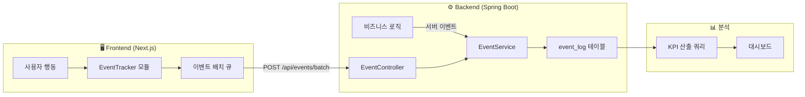

# SearchWeb KPI 측정 설계

> **문서 정보**
> - **버전:** v1.0.0
> - **작성일:** 2026-02-22
> - **근거 문서:** [searchweb_PRD.md](file:///e:/01.%20spring_projcet/SearchWeb/docs/Plan/searchweb_PRD.md)
> - **문서 목적:** PRD에 정의된 KPI를 실제로 측정하기 위한 이벤트 로그 수집/산출 체계 설계

<br>

## 1. 개요

SearchWeb PRD에서 정의된 5개 KPI 카테고리의 **목표 수치를 실제로 측정**하려면, 사용자 행동을 이벤트 단위로 수집하고 이를 기반으로 KPI를 산출하는 체계가 필요하다.

본 문서는 아래 3가지를 설계한다:
1. **수집** — 어떤 이벤트를 어디서(프론트엔드/백엔드) 수집할 것인가
2. **저장** — 수집된 이벤트를 어떤 스키마에 저장할 것인가
3. **산출** — 저장된 데이터를 어떻게 집계하여 KPI를 산출할 것인가

<br>

## 2. PRD KPI 요약 (측정 대상)

| 카테고리 | KPI | 목표 |
| :--- | :--- | :--- |
| ① 재사용 발생 | 저장 후 7일 내 재사용 사용자 비율 | ≥ 20% |
| | 탐색 기반 재사용 비율 (검색/태그/폴더 → 재열기) | ≥ 30% |
| | 사용자당 평균 주간 검색 횟수 | ≥ 1회 |
| ② 정리 효율 | AI 태그 포함 링크 비율 | ≥ 60% |
| | AI 추천 태그 채택률 | ≥ 50% |
| | 수동 태그 수정 비율 | ≤ 30% |
| | 링크 저장 완료 평균 소요 시간 | ≤ 8초 |
| ③ 행동 루프 | 전체 루프 경험 사용자 비율 | ≥ 25% |
| | 5개 이상 저장 사용자의 검색 사용 비율 | ≥ 50% |
| ④ 리텐션 | 7일 리텐션 | ≥ 30% |
| | 10개 이상 저장 사용자의 30일 재방문율 | ≥ 40% |
| ⑤ 사용자 확보 | 가입 사용자 수 (4주 내) | ≥ 50명 |
| | 첫 링크 저장 완료율 | ≥ 60% |
| | 7일 내 링크 저장 사용자 비율 | ≥ 50% |

<br>

---

## 3. 이벤트 정의 (Event Catalog)

### 3.1 핵심 이벤트 목록

| 이벤트 코드 | 설명 | 수집 위치 | 우선순위 |
| :--- | :--- | :--- | :--- |
| `USER_SIGNUP` | 회원 가입 완료 | Backend | P0 |
| `USER_LOGIN` | 로그인 성공 | Backend | P0 |
| `PAGE_VIEW` | 페이지 진입 | Frontend | P0 |
| `BOOKMARK_SAVE_START` | 링크 저장 다이얼로그 오픈 | Frontend | P0 |
| `BOOKMARK_SAVE_COMPLETE` | 링크 저장 완료 (API 성공) | Backend | P0 |
| `BOOKMARK_CLICK` | 저장된 링크 재열기 (외부 이동) | Frontend | P0 |
| `SEARCH_EXECUTE` | 검색 실행 | Frontend | P0 |
| `TAG_CLICK` | 태그 클릭 (필터링) | Frontend | P0 |
| `FOLDER_CLICK` | 폴더 클릭 (탐색) | Frontend | P0 |
| `AI_TAG_GENERATED` | AI 태그 생성 완료 | Backend | P0 |
| `AI_TAG_ACCEPTED` | AI 추천 태그 채택 (수정 없이 저장) | Frontend | P0 |
| `AI_TAG_MODIFIED` | AI 추천 태그 수정 후 저장 | Frontend | P0 |
| `AI_TAG_REJECTED` | AI 추천 태그 삭제/거부 | Frontend | P1 |
| `AI_FOLDER_ACCEPTED` | AI 추천 폴더 채택 | Frontend | P1 |
| `AI_FOLDER_MODIFIED` | AI 추천 폴더 변경 | Frontend | P1 |

### 3.2 이벤트 속성 (Properties) 상세

각 이벤트의 `event_properties` JSON에 포함되는 필드:

#### `USER_SIGNUP`
```json
{
  "provider": "google | local",      // 가입 방식
  "referrer": "direct | search | ..."
}
```

#### `USER_LOGIN`
```json
{
  "provider": "google | local",
  "days_since_signup": 5              // 가입 후 경과일
}
```

#### `BOOKMARK_SAVE_START`
```json
{
  "trigger": "dialog_open | shortcut | extension",  // 저장 진입 경로
  "timestamp_ms": 1708600000000                       // 밀리초 정밀도
}
```

#### `BOOKMARK_SAVE_COMPLETE`
```json
{
  "bookmark_id": 123,
  "has_ai_tag": true,                 // AI 태그 포함 여부
  "ai_tag_count": 3,                  // AI가 생성한 태그 수
  "accepted_tag_count": 2,            // 사용자가 채택한 AI 태그 수
  "modified_tag_count": 1,            // 사용자가 수정한 AI 태그 수
  "manual_tag_count": 0,              // 사용자가 직접 추가한 태그 수
  "has_ai_folder": true,              // AI 폴더 추천 사용 여부
  "folder_id": 45,
  "save_duration_ms": 6200,           // 저장 소요 시간 (밀리초)
  "url_domain": "developer.mozilla.org"
}
```

#### `BOOKMARK_CLICK`
```json
{
  "bookmark_id": 123,
  "source": "search | tag | folder | recent | direct",  // 진입 경로
  "days_since_save": 3                                    // 저장 후 경과일
}
```

#### `SEARCH_EXECUTE`
```json
{
  "query": "react hooks",
  "result_count": 12,
  "has_click": true                   // 검색 결과 클릭 여부
}
```

#### `TAG_CLICK` / `FOLDER_CLICK`
```json
{
  "tag_id": 10,                       // 또는 folder_id
  "tag_name": "React",                // 또는 folder_name
  "result_count": 8
}
```

#### `AI_TAG_GENERATED`
```json
{
  "bookmark_id": 123,
  "generated_tags": ["React", "Frontend", "Tutorial"],
  "tag_count": 3,
  "model_version": "v1"
}
```

<br>

---

## 4. 수집 아키텍처

### 4.1 전체 흐름

> 💡 **다이어그램을 그래픽으로 렌더링해서 보려면?**  
> 현재 사용 중인 마크다운 뷰어에서 아래 코드가 그래프로 그려지지 않는다면, 아래 `mermaid` 코드 블록 안의 텍스트를 복사하여 **[Mermaid Live Editor](https://mermaid.live/)** 의 코딩 창에 붙여넣으시면 다이어그램을 바로 확인하실 수 있습니다.



### 4.2 프론트엔드 수집 (Client-side)

**수집 대상:** 사용자 UI 상호작용 이벤트

| 이벤트 | 수집 시점 | 컴포넌트 |
| :--- | :--- | :--- |
| `PAGE_VIEW` | 라우트 변경 시 자동 | `layout.tsx` / 미들웨어 |
| `BOOKMARK_SAVE_START` | 저장 다이얼로그 마운트 | `SaveLinkDialog` |
| `BOOKMARK_CLICK` | 북마크 URL 클릭 | `BookmarkCard` |
| `SEARCH_EXECUTE` | 검색 API 호출 시 | `SearchBar` |
| `TAG_CLICK` | 태그 필터 클릭 시 | `TagList` |
| `FOLDER_CLICK` | 폴더 트리 클릭 시 | `FolderTree` |
| `AI_TAG_ACCEPTED/MODIFIED` | 저장 시 AI 태그 상태 비교 | `SaveLinkDialog` |

**구현 방식:**

```typescript
// lib/event-tracker.ts
interface TrackEvent {
  eventType: string;
  properties?: Record<string, unknown>;
}

class EventTracker {
  private queue: TrackEvent[] = [];
  private sessionId: string;

  constructor() {
    this.sessionId = crypto.randomUUID();
    // 30초마다 또는 큐가 10개 이상이면 배치 전송
    setInterval(() => this.flush(), 30_000);
  }

  track(eventType: string, properties?: Record<string, unknown>) {
    this.queue.push({
      eventType,
      properties: {
        ...properties,
        sessionId: this.sessionId,
        pageUrl: window.location.pathname,
        timestamp: Date.now(),
      },
    });

    if (this.queue.length >= 10) {
      this.flush();
    }
  }

  private async flush() {
    if (this.queue.length === 0) return;
    const events = [...this.queue];
    this.queue = [];

    try {
      await fetch('/api/events/batch', {
        method: 'POST',
        headers: { 'Content-Type': 'application/json' },
        body: JSON.stringify({ events }),
      });
    } catch (e) {
      // 실패 시 큐에 다시 추가 (최대 100개)
      this.queue = [...events, ...this.queue].slice(0, 100);
    }
  }
}

export const tracker = new EventTracker();
```

### 4.3 백엔드 수집 (Server-side)

**수집 대상:** API 호출 결과 및 시스템 이벤트

| 이벤트 | 수집 시점 | 위치 |
| :--- | :--- | :--- |
| `USER_SIGNUP` | 회원 가입 완료 후 | `MemberService` |
| `USER_LOGIN` | 인증 성공 후 | `AuthenticationSuccessHandler` |
| `BOOKMARK_SAVE_COMPLETE` | 북마크 생성 API 성공 후 | `BookmarkServiceImpl` |
| `AI_TAG_GENERATED` | AI 태그 생성 완료 후 | AI 분류 Service |

**구현 방식:**

```java
// event/service/EventService.java
@Service
@RequiredArgsConstructor
public class EventService {
    private final EventLogDao eventLogDao;

    @Async  // 비동기 처리로 메인 로직 성능 영향 최소화
    public void track(Long memberId, String eventType, Map<String, Object> properties) {
        EventLog log = EventLog.builder()
            .memberId(memberId)
            .eventType(eventType)
            .eventProperties(properties)  // JSON 변환
            .createdAt(LocalDateTime.now())
            .build();
        eventLogDao.insert(log);
    }
}
```

```java
// 사용 예시: BookmarkServiceImpl.java
@Override
public BookmarkDto createBookmark(Long memberId, BookmarkRequests.CreateDto request) {
    // ... 기존 북마크 생성 로직 ...
    BookmarkDto result = bookmarkDao.save(bookmark);
    
    // 이벤트 로그 수집
    eventService.track(memberId, "BOOKMARK_SAVE_COMPLETE", Map.of(
        "bookmark_id", result.getId(),
        "has_ai_tag", request.hasAiTag(),
        "ai_tag_count", request.getAiTagCount(),
        "url_domain", extractDomain(request.getUrl())
    ));
    
    return result;
}
```

<br>

---

## 5. 데이터 스키마

### 5.1 event_log 테이블

```sql
-- 이벤트 로그 테이블
CREATE TABLE event_log (
    id              BIGSERIAL       PRIMARY KEY,
    member_id       BIGINT          NOT NULL,
    event_type      VARCHAR(50)     NOT NULL,
    event_properties JSONB          DEFAULT '{}',
    session_id      VARCHAR(100),
    page_url        VARCHAR(500),
    created_at      TIMESTAMP       NOT NULL DEFAULT NOW(),
    
    -- 외래키
    CONSTRAINT fk_event_member FOREIGN KEY (member_id) REFERENCES member(member_id)
);

-- 핵심 인덱스
CREATE INDEX idx_event_log_member_type      ON event_log (member_id, event_type);
CREATE INDEX idx_event_log_type_created     ON event_log (event_type, created_at);
CREATE INDEX idx_event_log_created_at       ON event_log (created_at);
CREATE INDEX idx_event_log_session          ON event_log (session_id);

-- JSONB 내부 필드 검색용 (필요 시)
CREATE INDEX idx_event_log_bookmark_id      ON event_log ((event_properties->>'bookmark_id'));
```

### 5.2 kpi_daily_snapshot 테이블 (집계 캐시)

```sql
-- 일별 KPI 스냅샷 (매일 집계 배치로 갱신)
CREATE TABLE kpi_daily_snapshot (
    id              BIGSERIAL       PRIMARY KEY,
    snapshot_date   DATE            NOT NULL,
    kpi_code        VARCHAR(50)     NOT NULL,       -- e.g. 'REUSE_7D_RATE'
    kpi_value       DECIMAL(10,4)   NOT NULL,
    sample_size     BIGINT          DEFAULT 0,      -- 모수
    metadata        JSONB           DEFAULT '{}',
    created_at      TIMESTAMP       NOT NULL DEFAULT NOW(),
    
    UNIQUE (snapshot_date, kpi_code)
);
```

<br>

---

## 6. KPI ↔ 이벤트 매핑 및 산출 쿼리

### ① 재사용 발생

#### KPI-1.1: 저장 후 7일 내 재사용 사용자 비율

```sql
-- 목표: ≥ 20%
-- 분자: 저장 후 7일 내 BOOKMARK_CLICK 발생 사용자 수
-- 분모: BOOKMARK_SAVE_COMPLETE 발생 사용자 수

WITH save_users AS (
    SELECT DISTINCT member_id
    FROM event_log
    WHERE event_type = 'BOOKMARK_SAVE_COMPLETE'
      AND created_at >= :period_start AND created_at < :period_end
),
reuse_users AS (
    SELECT DISTINCT s.member_id
    FROM event_log s
    JOIN event_log c ON s.member_id = c.member_id
    WHERE s.event_type = 'BOOKMARK_SAVE_COMPLETE'
      AND c.event_type = 'BOOKMARK_CLICK'
      AND c.created_at BETWEEN s.created_at AND s.created_at + INTERVAL '7 days'
      AND s.created_at >= :period_start AND s.created_at < :period_end
)
SELECT
    (SELECT COUNT(*) FROM reuse_users)::DECIMAL
    / NULLIF((SELECT COUNT(*) FROM save_users), 0) * 100
    AS reuse_7d_rate;
```

#### KPI-1.2: 탐색 기반 재사용 비율

```sql
-- 목표: ≥ 30%
-- 세션 내에서 탐색(검색/태그/폴더) → 재열기(BOOKMARK_CLICK)가 발생한 비율

WITH explore_sessions AS (
    -- 탐색 행위가 있는 세션
    SELECT DISTINCT session_id
    FROM event_log
    WHERE event_type IN ('SEARCH_EXECUTE', 'TAG_CLICK', 'FOLDER_CLICK')
      AND created_at >= :period_start AND created_at < :period_end
),
reuse_after_explore AS (
    -- 탐색 후 재열기가 발생한 세션
    SELECT DISTINCT e.session_id
    FROM event_log e
    JOIN event_log c ON e.session_id = c.session_id
    WHERE e.event_type IN ('SEARCH_EXECUTE', 'TAG_CLICK', 'FOLDER_CLICK')
      AND c.event_type = 'BOOKMARK_CLICK'
      AND c.created_at > e.created_at
      AND e.created_at >= :period_start AND e.created_at < :period_end
)
SELECT
    (SELECT COUNT(*) FROM reuse_after_explore)::DECIMAL
    / NULLIF((SELECT COUNT(*) FROM explore_sessions), 0) * 100
    AS explore_reuse_rate;
```

#### KPI-1.3: 사용자당 평균 주간 검색 횟수

```sql
-- 목표: ≥ 1회/주
SELECT
    member_id,
    COUNT(*)::DECIMAL / GREATEST(
        EXTRACT(EPOCH FROM (:period_end - :period_start)) / 604800, 1
    ) AS weekly_search_avg
FROM event_log
WHERE event_type = 'SEARCH_EXECUTE'
  AND created_at >= :period_start AND created_at < :period_end
GROUP BY member_id;

-- 전체 평균
SELECT AVG(weekly_search_avg) FROM (위 쿼리) sub;
```

---

### ② 정리 효율

#### KPI-2.1: AI 태그 포함 링크 비율

```sql
-- 목표: ≥ 60%
SELECT
    COUNT(CASE WHEN (event_properties->>'has_ai_tag')::boolean = true THEN 1 END)::DECIMAL
    / NULLIF(COUNT(*), 0) * 100
    AS ai_tag_rate
FROM event_log
WHERE event_type = 'BOOKMARK_SAVE_COMPLETE'
  AND created_at >= :period_start AND created_at < :period_end;
```

#### KPI-2.2: AI 추천 태그 채택률

```sql
-- 목표: ≥ 50%
-- 채택된 태그 수 / AI가 생성한 전체 태그 수
SELECT
    SUM((event_properties->>'accepted_tag_count')::int)::DECIMAL
    / NULLIF(SUM((event_properties->>'ai_tag_count')::int), 0) * 100
    AS ai_tag_accept_rate
FROM event_log
WHERE event_type = 'BOOKMARK_SAVE_COMPLETE'
  AND (event_properties->>'has_ai_tag')::boolean = true
  AND created_at >= :period_start AND created_at < :period_end;
```

#### KPI-2.3: 수동 태그 수정 비율

```sql
-- 목표: ≤ 30%
SELECT
    SUM((event_properties->>'modified_tag_count')::int)::DECIMAL
    / NULLIF(SUM((event_properties->>'ai_tag_count')::int), 0) * 100
    AS ai_tag_modify_rate
FROM event_log
WHERE event_type = 'BOOKMARK_SAVE_COMPLETE'
  AND (event_properties->>'has_ai_tag')::boolean = true
  AND created_at >= :period_start AND created_at < :period_end;
```

#### KPI-2.4: 링크 저장 소요 시간

```sql
-- 목표: ≤ 8초 (8000ms)
SELECT
    AVG((event_properties->>'save_duration_ms')::int) AS avg_save_duration_ms,
    PERCENTILE_CONT(0.5) WITHIN GROUP (
        ORDER BY (event_properties->>'save_duration_ms')::int
    ) AS median_save_duration_ms,
    PERCENTILE_CONT(0.95) WITHIN GROUP (
        ORDER BY (event_properties->>'save_duration_ms')::int
    ) AS p95_save_duration_ms
FROM event_log
WHERE event_type = 'BOOKMARK_SAVE_COMPLETE'
  AND event_properties->>'save_duration_ms' IS NOT NULL
  AND created_at >= :period_start AND created_at < :period_end;
```

---

### ③ 행동 루프 형성

#### KPI-3.1: 전체 루프 경험 사용자 비율

```sql
-- 목표: ≥ 25%
-- "저장 → 분류 → 탐색 → 재사용" 모든 단계를 경험한 사용자

WITH active_users AS (
    SELECT DISTINCT member_id FROM event_log
    WHERE created_at >= :period_start AND created_at < :period_end
),
step_save AS (
    SELECT DISTINCT member_id FROM event_log
    WHERE event_type = 'BOOKMARK_SAVE_COMPLETE'
      AND created_at >= :period_start
),
step_classify AS (
    -- AI 태그가 포함된 저장 = 자동 분류 경험
    SELECT DISTINCT member_id FROM event_log
    WHERE event_type = 'BOOKMARK_SAVE_COMPLETE'
      AND (event_properties->>'has_ai_tag')::boolean = true
      AND created_at >= :period_start
),
step_explore AS (
    SELECT DISTINCT member_id FROM event_log
    WHERE event_type IN ('SEARCH_EXECUTE', 'TAG_CLICK', 'FOLDER_CLICK')
      AND created_at >= :period_start
),
step_reuse AS (
    SELECT DISTINCT member_id FROM event_log
    WHERE event_type = 'BOOKMARK_CLICK'
      AND created_at >= :period_start
),
full_loop_users AS (
    SELECT s.member_id
    FROM step_save s
    JOIN step_classify c ON s.member_id = c.member_id
    JOIN step_explore e ON s.member_id = e.member_id
    JOIN step_reuse r ON s.member_id = r.member_id
)
SELECT
    (SELECT COUNT(*) FROM full_loop_users)::DECIMAL
    / NULLIF((SELECT COUNT(*) FROM active_users), 0) * 100
    AS full_loop_rate;
```

#### KPI-3.2: 5개 이상 저장 사용자의 검색 사용 비율

```sql
-- 목표: ≥ 50%
WITH power_savers AS (
    SELECT member_id, COUNT(*) AS save_count
    FROM event_log
    WHERE event_type = 'BOOKMARK_SAVE_COMPLETE'
    GROUP BY member_id
    HAVING COUNT(*) >= 5
),
searchers AS (
    SELECT DISTINCT member_id
    FROM event_log
    WHERE event_type = 'SEARCH_EXECUTE'
)
SELECT
    COUNT(DISTINCT s.member_id)::DECIMAL
    / NULLIF(COUNT(DISTINCT p.member_id), 0) * 100
    AS power_saver_search_rate
FROM power_savers p
LEFT JOIN searchers s ON p.member_id = s.member_id;
```

---

### ④ 리텐션

#### KPI-4.1: 7일 리텐션

```sql
-- 목표: ≥ 30%
-- D0 가입 → D7에 활동(로그인/페이지뷰)이 있는 사용자

WITH signups AS (
    SELECT member_id, MIN(created_at)::date AS signup_date
    FROM event_log
    WHERE event_type = 'USER_SIGNUP'
      AND created_at >= :cohort_start AND created_at < :cohort_end
    GROUP BY member_id
),
day7_active AS (
    SELECT DISTINCT s.member_id
    FROM signups s
    JOIN event_log e ON s.member_id = e.member_id
    WHERE e.created_at::date BETWEEN s.signup_date + 6 AND s.signup_date + 8
      AND e.event_type IN ('USER_LOGIN', 'PAGE_VIEW')
)
SELECT
    (SELECT COUNT(*) FROM day7_active)::DECIMAL
    / NULLIF((SELECT COUNT(*) FROM signups), 0) * 100
    AS retention_7d;
```

#### KPI-4.2: 10개 이상 저장 사용자의 30일 재방문율

```sql
-- 목표: ≥ 40%
WITH heavy_users AS (
    SELECT member_id
    FROM event_log
    WHERE event_type = 'BOOKMARK_SAVE_COMPLETE'
    GROUP BY member_id
    HAVING COUNT(*) >= 10
),
first_activity AS (
    SELECT member_id, MIN(created_at)::date AS first_date
    FROM event_log
    WHERE member_id IN (SELECT member_id FROM heavy_users)
    GROUP BY member_id
),
day30_active AS (
    SELECT DISTINCT f.member_id
    FROM first_activity f
    JOIN event_log e ON f.member_id = e.member_id
    WHERE e.created_at::date BETWEEN f.first_date + 28 AND f.first_date + 32
      AND e.event_type IN ('USER_LOGIN', 'PAGE_VIEW')
)
SELECT
    (SELECT COUNT(*) FROM day30_active)::DECIMAL
    / NULLIF((SELECT COUNT(*) FROM heavy_users), 0) * 100
    AS heavy_user_30d_retention;
```

---

### ⑤ 사용자 확보

#### KPI-5.1: 가입 사용자 수

```sql
-- 목표: 4주 내 ≥ 50명
SELECT COUNT(DISTINCT member_id) AS total_signups
FROM event_log
WHERE event_type = 'USER_SIGNUP'
  AND created_at >= :launch_date
  AND created_at < :launch_date + INTERVAL '4 weeks';
```

#### KPI-5.2: 첫 링크 저장 완료율

```sql
-- 목표: ≥ 60%
WITH signups AS (
    SELECT DISTINCT member_id FROM event_log
    WHERE event_type = 'USER_SIGNUP'
      AND created_at >= :period_start AND created_at < :period_end
),
first_savers AS (
    SELECT DISTINCT member_id FROM event_log
    WHERE event_type = 'BOOKMARK_SAVE_COMPLETE'
      AND member_id IN (SELECT member_id FROM signups)
)
SELECT
    (SELECT COUNT(*) FROM first_savers)::DECIMAL
    / NULLIF((SELECT COUNT(*) FROM signups), 0) * 100
    AS first_save_rate;
```

#### KPI-5.3: 7일 내 링크 저장 사용자 비율

```sql
-- 목표: ≥ 50%
WITH signups AS (
    SELECT member_id, MIN(created_at) AS signup_at
    FROM event_log
    WHERE event_type = 'USER_SIGNUP'
      AND created_at >= :period_start AND created_at < :period_end
    GROUP BY member_id
),
early_savers AS (
    SELECT DISTINCT s.member_id
    FROM signups s
    JOIN event_log e ON s.member_id = e.member_id
    WHERE e.event_type = 'BOOKMARK_SAVE_COMPLETE'
      AND e.created_at <= s.signup_at + INTERVAL '7 days'
)
SELECT
    (SELECT COUNT(*) FROM early_savers)::DECIMAL
    / NULLIF((SELECT COUNT(*) FROM signups), 0) * 100
    AS early_save_rate;
```

<br>

---

## 7. 대시보드 구성안

### 7.1 MVP 대시보드 (어드민 페이지)

초기 MVP 규모(50명)에서는 **간단한 어드민 대시보드 페이지**로 충분하다.

| 섹션 | 표시 지표 | 시각화 |
| :--- | :--- | :--- |
| **Overview** | 총 가입자 수, 일별 신규 가입, 일별 활성 사용자(DAU) | 숫자 카드 + 라인 차트 |
| **재사용** | 7일 내 재사용률, 탐색→재사용 비율, 주간 검색 횟수 | 게이지 + 라인 차트 |
| **정리 효율** | AI 태그 비율, 채택률, 수정률, 평균 저장 시간 | 게이지 + 바 차트 |
| **행동 루프** | 루프 완주율, 파워 유저 검색 비율 | 퍼널 차트 |
| **리텐션** | Day-1/3/7/14/30 리텐션 곡선 | 리텐션 차트 |
| **이벤트 로그** | 최근 이벤트 실시간 피드 | 테이블 (디버깅용) |

### 7.2 KPI 집계 배치

```
┌─────────────────────────────────┐
│    Daily KPI Batch (매일 03:00) │
│                                 │
│  1. event_log 기반 KPI 쿼리 실행 │
│  2. kpi_daily_snapshot 갱신      │
│  3. 목표 미달 시 알림 (선택)      │
└─────────────────────────────────┘
```

Spring Boot의 `@Scheduled` 또는 별도 배치 스크립트로 일별 집계를 수행하고, `kpi_daily_snapshot` 테이블에 결과를 적재한다.

<br>

---

## 8. 구현 우선순위

### Phase 1 (MVP1 출시 전 필수) — P0

| 항목 | 설명 |
| :--- | :--- |
| `event_log` 테이블 생성 | DDL 실행 + 인덱스 |
| `EventService` 구현 | 비동기 이벤트 저장 서비스 |
| `EventController` 구현 | 프론트엔드 배치 이벤트 수신 API |
| 프론트엔드 `EventTracker` 모듈 | 이벤트 큐잉 + 배치 전송 |
| 핵심 6개 이벤트 수집 | `USER_SIGNUP`, `USER_LOGIN`, `BOOKMARK_SAVE_COMPLETE`, `BOOKMARK_CLICK`, `SEARCH_EXECUTE`, `PAGE_VIEW` |
| Backend 이벤트 삽입 | 회원가입/로그인/북마크 생성 시 이벤트 발행 |
| Frontend 이벤트 삽입 | 저장 다이얼로그, 링크 클릭, 검색, 태그/폴더 클릭 시 이벤트 발행 |

### Phase 2 (출시 후 2주 이내) — P1

| 항목 | 설명 |
| :--- | :--- |
| AI 관련 이벤트 수집 | `AI_TAG_GENERATED`, `AI_TAG_ACCEPTED/MODIFIED/REJECTED` |
| `kpi_daily_snapshot` 배치 | 일별 KPI 자동 집계 |
| 어드민 대시보드 기본 화면 | KPI 카드 + 기본 차트 |
| 저장 소요 시간 측정 | `BOOKMARK_SAVE_START` ↔ `BOOKMARK_SAVE_COMPLETE` 연동 |

### Phase 3 (출시 후 4주 이내) — P2

| 항목 | 설명 |
| :--- | :--- |
| 리텐션 커브 시각화 | Day-N 리텐션 차트 |
| 행동 루프 퍼널 분석 | 단계별 이탈률 시각화 |
| 코호트 분석 | 가입 주차별 KPI 비교 |
| 이벤트 로그 정리 정책 | 90일 초과 로그 아카이브/삭제 |

<br>

---

## 9. 주의사항 및 운영 가이드

### 9.1 성능
- 이벤트 수집은 반드시 **비동기(@Async)**로 처리하여 메인 비즈니스 로직 성능에 영향을 주지 않도록 한다
- 프론트엔드는 **배치 전송**(30초 간격 또는 10건 이상)으로 네트워크 부하를 최소화한다
- `event_log`에 적절한 인덱스를 유지하고, 데이터 증가 시 파티셔닝을 검토한다

### 9.2 개인정보
- `event_properties`에 **개인 식별 정보(이름, 이메일 등)를 저장하지 않는다**
- 검색어(`query`)는 분석에 필요하나, 개인정보 포함 가능성이 있으므로 **해시 처리 또는 익명화 정책**을 수립한다
- 데이터 보관 기간 정책을 수립하고 초과 시 삭제/아카이브한다

### 9.3 데이터 신뢰성
- 이벤트 수집 실패는 **사용자 UX에 영향을 주지 않도록** 별도 처리한다 (fail-silent)
- 프론트엔드 전송 실패 시 큐에 재적재하되, 최대 100건으로 제한한다
- 집계 쿼리 결과는 `NULLIF` 등으로 0-division을 방지한다
