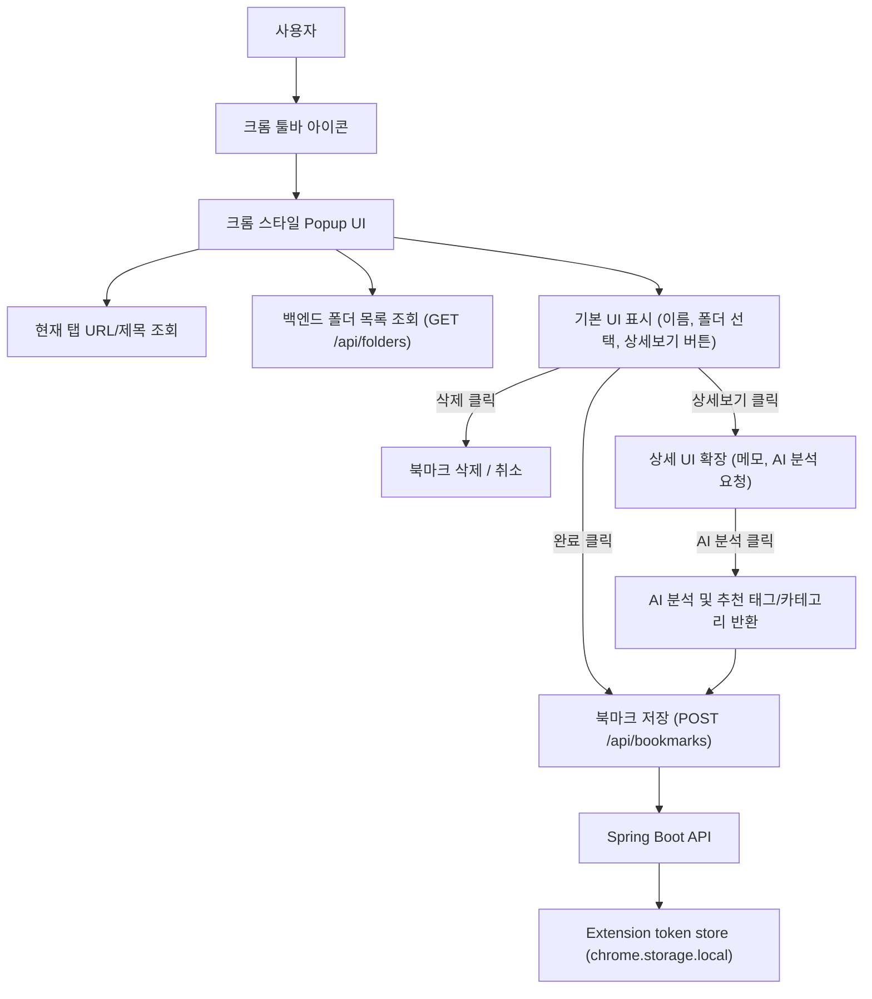
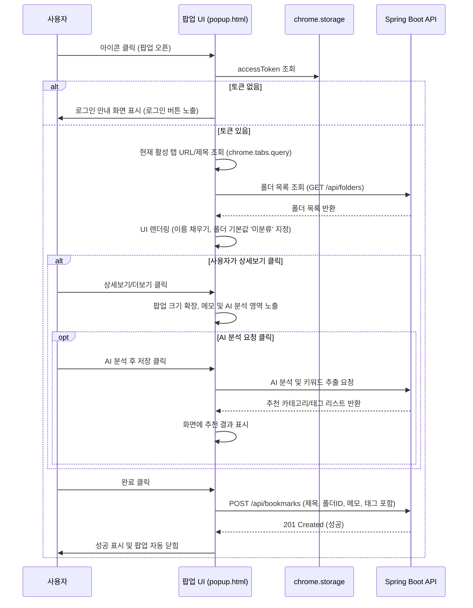

# 크롬 확장 프로그램 북마크 저장 계획서

## 1. 목표

우리 서비스는 AI 링크(북마크) 관리 서비스다. 사용자가 웹앱에 들어와 저장 버튼을 누르는 흐름보다 더 자연스럽게, 크롬 기본 브라우저 북마크와 같이 아이콘 클릭 시 직관적인 팝업을 띄우고 즉시 편집하거나 저장할 수 있는 UI/UX를 제공한다.

1차 목표는 다음과 같다.

- 기본 동작은 아이콘 클릭 즉시 크롬 스타일의 저장 팝업을 노출한다.
- 팝업 내에서 북마크의 **이름(제목) 편집** 및 **저장할 폴더 선택**을 가능하게 한다.
- 저장 폴더 목록의 기본 선택값은 `미분류(UNORGANIZED)` 폴더이며, 사용자가 직접 다른 폴더를 선택할 수 있게 한다.
- **상세보기(더보기) 확장 옵션**을 통해 메모 입력, AI 분석 요청 등의 확장 기능을 사용자 선택에 따라 노출하고 실행할 수 있도록 한다.
- 팝업 하단에 최종 저장 처리를 위한 **완료** 버튼과 북마크 저장을 취소하거나 삭제하기 위한 **삭제** 버튼을 배치한다.

## 2. 초보자를 위한 크롬 확장 기본 개념

크롬 확장 프로그램은 웹앱과 비슷하지만 실행 위치와 권한 모델이 다르다.

### 2.1 manifest.json

확장 프로그램의 설정 파일이다. 이름, 버전, 아이콘, 권한, 백그라운드 스크립트, 팝업 화면 등을 선언한다.

크롬 확장은 현재 Manifest V3를 기준으로 작성한다.

```json
{
  "manifest_version": 3,
  "name": "ReLink",
  "version": "0.1.0"
}
```

### 2.2 action

브라우저 오른쪽 위 툴바에 보이는 확장 프로그램 아이콘이다. 디폴트 동작이 팝업 노출이므로 `manifest.json`의 `action`에 `default_popup`을 기본으로 지정한다.

사용자가 아이콘을 클릭하면 설정된 `default_popup` 페이지(예: `popup/popup.html`)가 즉시 열리며, 이 경우 백그라운드 서비스 워커의 `chrome.action.onClicked` 이벤트는 호출되지 않고 팝업 스크립트가 로드되면서 실행된다.

### 2.3 service worker

Manifest V3의 백그라운드 실행 단위다. 항상 켜져 있는 서버가 아니라, 클릭이나 메시지 같은 이벤트가 들어올 때 잠깐 실행되고 유휴 상태가 되면 종료될 수 있다.

우리 확장에서 service worker는 다음 일을 한다.

- 백엔드와의 API 통신 보조 및 백그라운드 작업 수행
- 로그인 토큰 갱신 및 토큰 유효성 검사
- 알림 또는 뱃지를 통한 상태 표시

### 2.4 popup

아이콘 클릭 시 뜨는 작은 UI로, 기본 동작으로 활성화된다. 크롬 기본 북마크 UI와 동일하게 좌측 썸네일/파비콘, 우측 북마크 이름(수정 가능) 및 폴더 선택(기본값: 미분류, API 연동) 영역이 기본으로 노출된다.

팝업의 주요 역할은 다음과 같다.

- 현재 탭의 URL, 제목을 가져와 화면에 표시
- 제목 편집 기능 (이름 입력 필드)
- 저장 폴더 선택 기능 (기본값: 미분류, API를 통해 사용자의 폴더 목록 조회 후 선택 가능하게 제공)
- 상세보기/더보기(확장) 버튼 제공: 클릭 시 팝업 창이 확장되며 추가 기능 노출
  - 메모 입력란
  - AI 분석 후 저장 버튼 (클릭 시 백엔드 AI 분석 결과 연동 및 저장)
- 하단 완료(저장 확인) 및 삭제(저장된 북마크 삭제) 버튼 제공

### 2.5 permissions

확장 프로그램이 브라우저 기능을 쓰기 위해 요청하는 권한이다. 권한은 최소화해야 크롬 웹스토어 심사와 사용자 신뢰에 유리하다.

1차 권장 권한은 다음과 같다.

- `activeTab`: 사용자가 아이콘을 누른 현재 탭의 URL/제목에 접근
- `storage`: 확장 설정과 토큰 저장
- `identity`: OAuth 로그인 흐름 처리

가능하면 `tabs` 권한은 피한다. `activeTab`만으로도 사용자가 명시적으로 클릭한 현재 탭 저장은 처리할 수 있다.

### 2.6 host_permissions

확장 프로그램이 외부 서버에 요청할 수 있게 허용하는 대상이다.

예시는 다음과 같다.

```json
{
  "host_permissions": [
    "http://localhost:8080/*",
    "https://api.relink.example/*"
  ]
}
```

운영 도메인이 정해지면 `https://api.relink.example/*`를 실제 백엔드 도메인으로 바꾼다.

### 2.7 content script는 1차에서 사용하지 않는다

content script는 사용자가 보고 있는 웹페이지 안에 주입되는 스크립트다. 페이지 DOM을 읽거나 조작할 때 필요하다.

이번 기능은 현재 탭의 URL/제목만 저장하면 되므로 content script가 필요 없다. content script를 넣지 않는 편이 권한도 적고 보안 설명도 단순하다.

## 3. 현재 서비스에서 확인한 사실

현재 코드베이스 기준으로 확장 프로그램은 기존 북마크 API를 대부분 재사용할 수 있다.

- 북마크 생성 API: `POST /api/bookmarks`
- 요청 필드: `url`, `memberFolderId`, `displayTitle`, `note`, `primaryCategoryId`, `tags`
- `memberFolderId`가 `null`이면 백엔드가 사용자별 `미분류(UNORGANIZED)` 폴더를 찾아 저장한다.
- 미분류 폴더는 없으면 생성하는 구조다.
- 북마크 생성은 인증된 사용자 ID(`@CurrentMemberId`)가 필요하다.
- 웹 프론트는 Access Token을 Zustand 메모리에 저장하고 `Authorization: Bearer` 헤더로 API를 호출한다.
- Refresh Token은 HttpOnly 쿠키로 관리한다.
- 현재 OAuth 성공 처리는 웹 프론트 도메인으로만 리다이렉트하도록 설계되어 있다.
- 현재 `AuthServiceImpl.issueRefreshToken(memberId)`는 같은 사용자의 기존 Refresh Token을 전부 삭제한 뒤 새로 발급한다.
- `BookmarkDao.checkBookmarkExistsByUrl` 메서드는 Java 쪽에 있지만, MyBatis XML 매퍼에는 대응 쿼리가 보이지 않는다.

따라서 핵심 작업은 확장 프로그램 UI보다 인증 연결과 세션 분리다.

## 4. 제품 UX 설계

### 4.1 기본 동작: 크롬 스타일 북마크 팝업

사용자가 확장 아이콘을 클릭하면 팝업(`popup.html`)이 즉시 실행된다.

**동작 흐름:**
1. 팝업이 로드되면서 현재 활성화된 탭의 URL과 제목을 읽는다.
2. 로그인 상태를 확인하고, 로그인이 되어 있다면 백엔드에서 **사용자의 폴더 목록**(`GET /api/folders` 등)을 비동기 조회하여 폴더 선택 드롭다운에 구성한다.
3. 사용자에게 다음 정보를 담은 크롬 스타일 UI를 노출한다.
   - **좌측 영역**: 페이지 대표 이미지(썸네일) 또는 파비콘
   - **우측 영역**: 이름(이름 편집 필드), 폴더(드롭다운, 기본값: 미분류)
   - **하단 영역**: 상세보기(더보기) 버튼, 완료 버튼, 삭제 버튼
4. 사용자가 완료를 누르거나 변경 사항을 수정하면 `POST /api/bookmarks`가 호출되어 최종 저장 및 수정이 반영된다.

저장 요청 예시 (기본):
```json
{
  "url": "https://example.com/article",
  "displayTitle": "Stitch - Design with AI",
  "memberFolderId": 12, // 사용자가 선택한 폴더 ID (기본값은 미분류 폴더 ID)
  "note": null,
  "tags": null
}
```

### 4.2 확장 동작: 상세보기 및 AI 기능 제공

팝업 내의 **상세보기(더보기)** 버튼을 클릭하면 팝업의 하단 영역이 확장(또는 전환)되면서 상세 옵션이 나타난다.

**상세보기 제공 기능:**
- **메모 입력**: 북마크에 추가할 간단한 메모를 작성할 수 있다.
- **AI 분석 후 저장**:
  - 버튼을 클릭하면 현재 페이지의 본문을 분석(혹은 백엔드에서 스크랩 및 요약 처리)하여 AI 카테고리 추천, 요약본, 추천 태그를 화면에 표시한다.
  - 사용자는 AI가 추천한 태그나 카테고리를 확인하고 함께 저장할 수.
- **태그 직접 추가**: 콤마(,) 혹은 엔터로 태그를 직접 입력하여 추가할 수 있다.

확장된 저장 요청 예시:
```json
{
  "url": "https://example.com/article",
  "displayTitle": "수정된 제목",
  "memberFolderId": 12,
  "note": "AI 관련 디자인 툴 소개 아티클",
  "tags": ["AI", "Design", "Tool"],
  "aiAnalyze": true
}
```

### 4.3 로그인 필요 상태

로그인되어 있지 않은 상태에서 아이콘을 누르면 저장을 진행하지 않고, 로그인 유도 화면이 노출된다.

동작:
1. 팝업에서 토큰 유효성 검사 실패 시 로그인 안내 문구와 로그인 실행 버튼을 렌더링한다.
2. 로그인 버튼 클릭 시 OAuth 인증 페이지가 새 창(또는 웹 인증 플로우)으로 노출된다.
3. 로그인 성공 시 팝업 UI가 자동으로 북마크 저장 화면으로 갱신된다.

## 5. 권장 아키텍처



### 5.1 확장 프로그램 파일 구조

권장 구조:

```text
chrome-extension/
  manifest.json
  background/
    service-worker.js
  popup/
    popup.html       # 기본 크롬 스타일 북마크 팝업 (상세 확장 기능 포함)
    popup.js
    popup.css
  options/
    options.html     # 환경 설정 등 옵션 페이지
    options.js
    options.css
  shared/
    api.js           # 백엔드 API 통신 모듈 (폴더 목록 조회, 북마크 저장 등)
    auth.js
    config.js
    storage.js
  icons/
    icon16.png
    icon48.png
    icon128.png
```

첫 구현은 빌드 도구 없이 순수 HTML/CSS/JS로 시작하여 빠른 피드백 루프를 가질 수 있도록 하되, 폴더 드롭다운 및 확장 애니메이션 처리를 고려하여 깔끔하게 작성한다.

## 6. manifest 설계 초안

디폴트 동작으로 팝업을 띄우므로 `manifest.json`에 `default_popup`을 지정한다.

```json
{
  "manifest_version": 3,
  "name": "ReLink",
  "description": "현재 페이지를 ReLink에 저장합니다.",
  "version": "0.1.0",
  "action": {
    "default_title": "ReLink에 저장",
    "default_popup": "popup/popup.html",
    "default_icon": {
      "16": "icons/icon16.png",
      "48": "icons/icon48.png",
      "128": "icons/icon128.png"
    }
  },
  "background": {
    "service_worker": "background/service-worker.js",
    "type": "module"
  },
  "permissions": [
    "activeTab",
    "storage",
    "identity"
  ],
  "host_permissions": [
    "http://localhost:8080/*",
    "https://api.relink.example/*"
  ],
  "options_page": "options/options.html",
  "icons": {
    "16": "icons/icon16.png",
    "48": "icons/icon48.png",
    "128": "icons/icon128.png"
  }
}
```

## 7. 인증 설계

### 7.1 웹앱 토큰을 그대로 재사용하지 않는 이유

현재 웹앱의 Access Token은 Zustand 메모리에 있다. 크롬 확장 프로그램은 웹앱의 JS 메모리를 읽을 수 없다.

Refresh Token은 HttpOnly 쿠키다. 보안상 JS에서 읽을 수 없는 것이 맞다. 확장 프로그램이 이 쿠키에 의존해서 `/api/auth/refresh`를 호출하는 설계도 권장하지 않는다. SameSite, CORS, extension origin 문제 때문에 환경별로 깨질 가능성이 크다.

따라서 확장 프로그램은 별도 확장 세션을 갖는 것이 안전하다.

### 7.2 권장 로그인 흐름

권장 방식은 `chrome.identity.launchWebAuthFlow`와 백엔드의 일회성 코드 교환 방식이다.

흐름:

1. 확장 프로그램이 로그인 버튼 클릭 시 `chrome.identity.launchWebAuthFlow`를 호출한다.
2. 백엔드 OAuth 로그인 URL로 이동한다.
3. 사용자는 기존 Google/Naver/Kakao OAuth로 로그인한다.
4. OAuth 성공 후 백엔드는 Refresh Token을 URL에 직접 싣지 않는다.
5. 백엔드는 짧게 살아있는 일회성 `extensionLoginCode`를 발급한다.
6. 백엔드는 `https://<extension-id>.chromiumapp.org/callback?code=...`로 리다이렉트한다.
7. 확장 프로그램은 `code`를 받아 `/api/auth/extension/exchange`로 보낸다.
8. 백엔드는 확장용 Access Token과 Refresh Token을 반환한다.
9. 확장 프로그램은 토큰을 `chrome.storage.local`에 저장한다.

### 7.3 백엔드 인증 API 추가안

확장 전용 API를 별도로 둔다.

```text
POST /api/auth/extension/exchange
POST /api/auth/extension/refresh
POST /api/auth/extension/logout
GET  /api/auth/extension/member
```

요청/응답 예시:

```json
POST /api/auth/extension/exchange
{
  "code": "short-lived-one-time-code"
}
```

```json
{
  "success": true,
  "data": {
    "accessToken": "...",
    "refreshToken": "..."
  }
}
```

확장용 Refresh Token은 쿠키가 아니라 body로 주고받는다. Access Token은 기존처럼 `Authorization: Bearer` 헤더에 넣는다.

### 7.4 기존 웹 로그인 세션과 분리

현재 `issueRefreshToken(memberId)`는 같은 회원의 기존 Refresh Token을 모두 삭제한다. 이 메서드를 확장 로그인에 그대로 쓰면 웹에서 로그인한 사용자가 확장에 로그인하는 순간 웹 세션이 끊길 수 있다.

따라서 다음 중 하나가 필요하다.

- `issueRefreshTokenWithoutRevoking(memberId)` 같은 확장 전용 발급 메서드 추가
- 기존 발급 로직을 `revokeExistingSessions` 옵션을 받도록 분리
- `refresh_token` 테이블에 `client_type` 또는 `session_type`을 추가해 웹/확장 세션을 구분

1차 권장안:

- DB 스키마 변경 없이 새 세션을 추가 발급하는 메서드를 만든다.
- 웹 로그인은 기존 정책을 유지한다.
- 확장 로그인은 기존 웹 세션을 삭제하지 않는다.

## 8. 북마크 저장 API 설계

### 8.1 기존 API 및 폴더 목록 API 활용

확장 프로그램 팝업에서 기존 `POST /api/bookmarks`를 재사용하며, 폴더 드롭다운 구성을 위해 폴더 목록 조회 API가 필요하다.

**1. 폴더 목록 조회 API (`GET /api/folders` 혹은 기존 API)**
- 확장 프로그램이 켜질 때 로그인된 회원의 폴더 트리/목록을 가져와 드롭다운 리스트에 렌더링한다.
- 미분류 폴더를 첫 번째 기본 옵션으로 설정한다.

**2. 북마크 생성 API (`POST /api/bookmarks`)**
- 사용자가 선택한 폴더 ID(`memberFolderId`)와 수정된 이름(`displayTitle`)을 담아 요청을 전송한다.

확장 프로그램 요청 예시:
```json
{
  "url": "https://example.com",
  "displayTitle": "Stitch - Design with AI",
  "memberFolderId": 15, // 선택한 폴더 ID (미분류 혹은 사용자 지정 폴더)
  "note": "상세보기에서 입력한 메모 내용",
  "tags": ["AI", "디자인"],
  "aiAnalyze": false
}
```

백엔드 처리:
- 인증 사용자 ID 추출
- URL canonicalization
- link 생성 또는 조회
- `memberFolderId`가 전달되면 해당 폴더에 저장, 없거나 `null`이면 미분류 폴더 조회/생성하여 저장
- `member_saved_link` 저장
- 중복일 시 `409 CONFLICT` 또는 기존 북마크 업데이트(사용자가 수정 후 저장하는 것이므로 덮어쓰기 형태로 구현도 가능)

### 8.2 중복 체크 보완

확장 프로그램은 저장 전에 꼭 중복 체크를 하지 않아도 된다. 원클릭에서는 빠른 저장이 중요하므로 먼저 `POST /api/bookmarks`를 호출하고, `409 CONFLICT`를 "이미 저장됨"으로 해석하면 된다.

다만 저장된 페이지의 아이콘 상태를 미리 바꾸고 싶다면 `GET /api/bookmarks/check?url=...`가 안정적으로 동작해야 한다.

현재 확인된 리스크:

- Java 인터페이스에는 `checkBookmarkExistsByUrl`이 있다.
- MyBatis XML에는 해당 쿼리가 보이지 않는다.

따라서 아이콘 상태 표시를 넣기 전에는 매퍼 쿼리를 보완해야 한다.

권장 쿼리 의도:

```sql
SELECT COUNT(*)
FROM member_saved_link msl
JOIN link l ON msl.link_id = l.link_id
WHERE msl.created_by_member_id = #{memberId}
  AND l.canonical_url = #{canonicalUrl}
  AND msl.deleted_at IS NULL
  AND l.deleted_at IS NULL
```

주의: 서비스 메서드에서 이미 canonical URL을 계산한다면 DAO에는 canonical URL을 넘기는 편이 맞다.

## 9. 팝업 및 상세 저장 상세 흐름



### 9.1 저장 가능 URL

저장 가능한 URL:

- `http://...`
- `https://...`

저장하지 않는 URL:

- `chrome://...`
- `edge://...`
- `about:...`
- `file://...`
- 빈 URL

저장 불가일 때는 팝업 내에 `저장할 수 없는 페이지입니다` 문구를 노출하고 저장을 차단한다.

### 9.2 토큰 갱신

저장 API 또는 폴더 조회 API가 `401`을 반환하면 확장용 Refresh Token으로 Access Token을 갱신하고 1회만 재시도한다.

재시도도 실패하면:

- 요청을 중단한다.
- 저장된 토큰을 제거한다.
- 팝업 내 화면을 로그인 필요 상태로 갱신한다.

### 9.3 service worker 유휴 종료 대응

service worker는 언제든 종료될 수 있다. 따라서 중요한 상태는 메모리에만 두지 않는다.

`chrome.storage.local`에 저장할 것:

- Access Token
- Refresh Token
- API base URL
- 마지막 로그인 사용자 정보

메모리에만 둬도 되는 것:

- 현재 저장 중 여부

## 11. 향후 배치 분류와의 관계

이번 확장 프로그램은 "어디에 분류할지"를 결정하지 않는다. 링크를 빠르게 수집하는 입구 역할만 한다.

향후 배치 분류는 다음 대상을 처리하면 된다.

- `member_folder.folder_type = UNORGANIZED`에 저장된 링크
- 아직 분류되지 않은 링크
- 최근 저장된 링크
- 사용자가 직접 이동하지 않은 링크

배치 분류가 링크를 이동할 때 고려할 점:

- 사용자가 이미 수동으로 폴더를 옮긴 링크는 건드리지 않는다.
- 분류 실패 시 미분류에 그대로 둔다.
- 중복 저장 또는 이동 충돌을 안전하게 처리한다.
- 나중에 사용자에게 "자동 분류됨" 피드백을 줄 수 있게 로그를 남긴다.

## 12. 구현 단계

### Phase 0. 크롬 스타일 팝업 UI 및 뼈대 개발

목표:

- `chrome-extension/manifest.json` 생성 (`default_popup` 등록)
- `popup/popup.html`, `popup.css`, `popup.js` 뼈대 설계 (이름 편집, 폴더 선택, 완료/삭제 버튼)
- 로컬에서 `chrome://extensions`의 "압축해제된 확장 프로그램 로드"로 등록 및 팝업 정상 오픈 확인

완료 기준:

- 확장 아이콘이 크롬 툴바에 보인다.
- 아이콘 클릭 시 크롬 기본 디자인과 유사한 북마크 편집 팝업이 노출된다.

### Phase 1. 확장 전용 인증 만들기

목표:

- `chrome.identity.launchWebAuthFlow` 로그인 흐름 설계/구현
- 백엔드 extension exchange API 및 refresh API 추가
- 웹 세션과 확장 세션 분리 및 토큰 로컬 스토리지 보존

완료 기준:

- 팝업 내에서 비로그인 시 로그인 유도 화면이 보이고, 로그인 완료 시 북마크 UI로 전환된다.
- 로그인해도 기존 웹앱 로그인 상태가 끊기지 않는다.
- Access Token 만료 시 Refresh Token으로 갱신된다.

### Phase 2. 폴더 조회 및 북마크 저장 연동

목표:

- 팝업 오픈 시 현재 탭 정보 파싱 및 백엔드 폴더 목록 API 연동
- 폴더 드롭다운 렌더링 (기본 선택값: 미분류)
- '완료' 클릭 시 지정된 폴더로 `POST /api/bookmarks` 호출하여 저장 완료 피드백 제공

완료 기준:

- 사용자가 수정한 제목 및 선택한 폴더 정보로 북마크가 웹앱 내 링크 목록에 생성된다.
- 중복 저장 처리 시 오류 얼럿 대신 알맞은 피드백을 노출한다.

### Phase 3. 상세보기 확장 및 AI 분석 기능 구현

목표:

- 팝업 내 '상세보기(더보기)' 클릭 시 레이아웃 확장 및 메모 입력창 활성화
- AI 분석 연동 기능 추가 (분석 버튼 클릭 시 추천 카테고리/태그 리스트 렌더링 및 반영)
- '삭제' 클릭 시 저장 취소 또는 생성된 북마크 삭제 API 연동

완료 기준:

- 상세보기 클릭 시 팝업 크기가 부드럽게 확장되며 메모와 AI 추천 영역이 노출된다.
- AI 분석 결과를 활용해 메모와 태그를 함께 저장할 수 있다.

### Phase 4. 안정화와 배포 준비

목표:

- 오류 케이스 정리
- 권한 설명 문구 작성
- Chrome Web Store 패키징 준비
- 운영 API 도메인 연결

완료 기준:

- 로컬/개발/운영 API base URL을 구분할 수 있다.
- 크롬 확장 압축 패키지를 만들 수 있다.
- 개인정보 처리와 권한 사용 설명이 준비된다.
- 스토어 심사용 스크린샷과 설명이 준비된다.

## 13. 테스트 계획

### 13.1 확장 프로그램 수동 테스트

- 로그인하지 않은 상태에서 아이콘 클릭
- 로그인 후 `https://` 페이지 저장
- 같은 페이지 연속 저장
- `chrome://extensions` 같은 저장 불가 페이지 클릭
- Access Token 만료 후 저장
- Refresh Token 만료 후 저장
- 원클릭 모드에서 저장
- 확인 후 저장 모드에서 저장
- 옵션 전환 후 브라우저 재시작

### 13.2 백엔드 테스트

- `memberFolderId == null`이면 미분류 폴더에 저장
- 미분류 폴더가 없으면 생성
- 이미 있으면 기존 미분류 폴더 재사용
- 동일 링크 중복 저장 시 `409`
- 확장 로그인 시 웹 Refresh Token이 삭제되지 않음
- 확장 refresh API가 토큰을 정상 회전
- 확장 logout이 해당 refresh token만 삭제

### 13.3 보안 테스트

- URL에 Refresh Token이 노출되지 않음
- extension login code는 1회만 사용 가능
- extension login code는 짧은 TTL을 가짐
- Access Token 없이 저장 API 호출 시 401
- 만료/위조 토큰으로 저장 API 호출 시 401
- 확장 origin 이외의 잘못된 exchange 요청 차단

## 14. 주요 리스크와 대응

### 14.1 팝업과 원클릭 이벤트 충돌

리스크:

- manifest에 `default_popup`을 고정하면 `chrome.action.onClicked`가 호출되지 않는다.

대응:

- 기본 원클릭 모드에서는 popup을 비운다.
- 확인 후 저장 모드에서만 `chrome.action.setPopup`으로 popup을 동적으로 설정한다.

### 14.2 웹 세션과 확장 세션 충돌

리스크:

- 기존 `issueRefreshToken(memberId)`를 확장 로그인에 쓰면 웹 로그인 세션이 끊길 수 있다.

대응:

- 확장 전용 refresh token 발급 메서드를 만든다.
- 확장 로그인은 기존 세션을 삭제하지 않는다.

### 14.3 토큰 저장 보안

리스크:

- 확장 프로그램은 Refresh Token을 `chrome.storage.local`에 저장해야 한다.

대응:

- 토큰은 extension origin에서만 접근 가능하게 둔다.
- content script를 사용하지 않는다.
- 외부 페이지에 토큰을 전달하지 않는다.
- 로그에 토큰을 출력하지 않는다.
- refresh token 탈취 대응을 위해 서버의 refresh rotation을 유지한다.

### 14.4 중복 체크 미구현 가능성

리스크:

- `GET /api/bookmarks/check`가 Java 인터페이스와 XML 매퍼 불일치로 동작하지 않을 수 있다.

대응:

- 1차 원클릭 저장은 사전 체크 없이 `POST` 후 `409` 처리로 구현한다.
- 아이콘 상태 표시 기능을 넣기 전에 MyBatis 매퍼를 보완한다.

### 14.5 배치 자동 분류와 사용자 수동 수정 충돌

리스크:

- 사용자가 미분류에서 직접 옮긴 링크를 배치가 다시 옮길 수 있다.

대응:

- 배치 분류는 현재 폴더가 여전히 미분류인 링크만 처리한다.
- 수동 이동된 링크는 제외한다.
- 자동 분류 이력을 남긴다.

## 15. 1차 범위와 제외 범위

### 15.1 1차 포함

- Manifest V3 확장 프로그램 뼈대 및 기본 팝업 설정
- 크롬 스타일의 북마크 저장 팝업 UI (이름 수정, 폴더 선택 드롭다운)
- 상세보기 확장을 통한 메모 입력란 및 AI 분석 추천 연동
- 확장 전용 로그인/토큰 갱신 흐름
- 북마크 완료(저장) 및 삭제(취소) 연동
- 로컬 개발 환경에서 압축해제 확장 로드 및 테스트

### 15.2 1차 제외

- 전체 폴더 트리의 복잡한 조회/추가 UI (드롭다운 목록으로 단순화)
- 웹앱의 모든 북마크 세부 설정 모달 이식
- 팀원 공유 및 협업용 링크 저장 UI
- Chrome Web Store 최종 심사 제출 및 배포
- 모바일 브라우저 지원

## 16. 권장 구현 순서

1. `chrome-extension/manifest.json` 및 `popup.html` 기본 뼈대 제작 (팝업 노출 확인)
2. 확장 전용 로그인 API 백엔드 구현 및 팝업 내 로그인 연동 (토큰 보존)
3. 팝업에서 현재 활성 탭 URL/제목 조회 및 백엔드 폴더 목록 API 연동
4. 폴더 선택 드롭다운 구성 (기본값: 미분류)
5. '완료' 클릭 시 지정된 폴더 및 제목으로 북마크 생성 API (`POST /api/bookmarks`) 연동
6. '상세보기' 클릭 시 팝업 크기 확장 레이아웃 및 메모 입력 기능 구현
7. AI 분석 연동 기능 구현 (분석 요청 시 추천 결과 렌더링 및 저장 반영)
8. '삭제' 클릭 시 북마크 삭제 API 연동 및 팝업 종료
9. 운영 도메인 설정 및 Chrome Web Store 배포 패키지 준비

## 17. 수용 기준

- 사용자는 아이콘 클릭 시 노출되는 팝업을 통해 즉시 현재 페이지를 저장할 수 있다.
- 팝업에서 이름(제목) 수정 및 저장할 폴더 선택이 가능하다. (기본 폴더는 미분류)
- 상세보기 버튼을 눌러 메모 입력 및 AI 분석 추천 결과를 확인하고 저장에 활용할 수 있다.
- 팝업 내 삭제 버튼을 클릭하여 북마크 저장을 취소(또는 삭제)할 수 있다.
- 확장 로그인은 기존 웹 로그인 세션을 끊지 않는다.
- 확장 프로그램은 최소 권한으로 동작한다.

## 18. 참고 문서

- Chrome Extensions Manifest: https://developer.chrome.com/docs/extensions/reference/manifest
- chrome.action: https://developer.chrome.com/docs/extensions/reference/api/action
- activeTab: https://developer.chrome.com/docs/extensions/develop/concepts/activeTab
- Cross-origin network requests: https://developer.chrome.com/docs/extensions/develop/concepts/network-requests
- chrome.storage: https://developer.chrome.com/docs/extensions/reference/api/storage
- chrome.identity: https://developer.chrome.com/docs/extensions/reference/api/identity


## 19. 멀티 브라우저 확장 전략

크롬뿐 아니라 Edge, Firefox, Opera, Brave, Whale 같은 브라우저까지 고려한다면 처음부터 "Chrome extension"이 아니라 "WebExtensions 기반 브라우저 확장"으로 설계하는 것이 좋다.

다만 모든 브라우저를 동시에 같은 완성도로 지원하려고 하면 인증, 패키징, 스토어 심사, manifest 차이 때문에 초기 복잡도가 크게 올라간다. 따라서 권장 순서는 다음과 같다.

1. 1차: Chrome + Microsoft Edge
2. 2차: Firefox
3. 3차: Opera, Brave, Whale 등 Chromium 계열 확장
4. 4차: Safari

이 순서를 권장하는 이유는 Chrome과 Edge가 Chromium 기반이라 확장 API와 manifest 호환성이 높고, Firefox는 WebExtensions API를 지원하지만 네임스페이스, Promise 처리, manifest 일부 키, OAuth redirect URL에서 확인해야 할 차이가 있기 때문이다. Safari는 패키징 방식이 앱에 가까워 별도 단계로 보는 것이 안전하다.

### 19.1 핵심 방향

멀티 브라우저 지원을 고려한 핵심 원칙은 다음과 같다.

- 공통 기능 코드는 한 번만 작성한다.
- 브라우저별 차이는 얇은 adapter와 manifest 파일에서만 처리한다.
- Chrome 전용 API를 핵심 로직에 직접 섞지 않는다.
- 확장 ID, OAuth redirect URI, 스토어 배포 정보는 브라우저별 설정으로 분리한다.
- 빌드 결과물은 브라우저별 `dist` 폴더로 따로 만든다.

즉, 실제 저장/인증/API 호출 로직은 공통으로 두고, "어떤 브라우저에서 실행되는가"만 얇게 갈아끼우는 구조가 좋다.

### 19.2 디렉터리 구조 변경 권장안

현재 폴더명이 `chrome-extension`이어도 1차 개발은 가능하다. 하지만 장기적으로는 특정 브라우저 이름이 들어간 폴더명보다 `browser-extension` 또는 `extension`이 더 적절하다.

권장 구조:

```text
browser-extension/
  package.json
  src/
    background/
      service-worker.js
    popup/
      popup.html
      popup.js
      popup.css
    options/
      options.html
      options.js
      options.css
    shared/
      apiClient.js
      authClient.js
      browserApi.js
      config.js
      storage.js
      platform.js
  manifests/
    manifest.base.json
    manifest.chrome.json
    manifest.edge.json
    manifest.firefox.json
  scripts/
    build-extension.mjs
  dist/
    chrome/
    edge/
    firefox/
  icons/
    icon16.png
    icon48.png
    icon128.png
```

첫 단계에서 빌드 도구를 크게 들이고 싶지 않다면, `scripts/build-extension.mjs`가 다음 일을 하게 만들면 충분하다.

- `manifest.base.json` 읽기
- 대상 브라우저별 manifest patch 적용
- `src`와 `icons` 복사
- `dist/chrome`, `dist/edge`, `dist/firefox` 생성
- 각 `dist` 폴더를 zip으로 패키징

### 19.3 API 네임스페이스 전략

브라우저 확장 API는 크게 두 네임스페이스가 있다.

- Chrome, Edge, Opera 계열: `chrome.*`
- Firefox, Safari 계열 권장 형태: `browser.*`

Firefox도 Chrome 호환성을 위해 `chrome.*`를 일부 지원하지만, 장기적으로는 Promise 기반 `browser.*`를 기준으로 작성하고 Chromium 계열에서는 polyfill 또는 adapter를 쓰는 방식이 가장 관리하기 쉽다.

단순 래퍼로 시작할 때:

```js
// shared/browserApi.js
export const ext = globalThis.browser ?? globalThis.chrome;
```

규모가 커질 때 권장 방식:

```js
import browser from "webextension-polyfill";

const tabs = await browser.tabs.query({ active: true, currentWindow: true });
await browser.storage.local.set({ saveMode: "popup" });
```

주의할 점:

- 이벤트 핸들러에서 Promise 반환 지원은 브라우저별 차이가 있을 수 있다.
- 공통 코드에서는 `chrome.*`를 직접 호출하지 않는다.
- `browserApi.js`, `storage.js`, `authClient.js` 같은 adapter 내부에서만 브라우저 API를 호출한다.

### 19.4 manifest 분리 전략

공통 manifest와 브라우저별 manifest를 나눈다.

`manifest.base.json`:

```json
{
  "manifest_version": 3,
  "name": "ReLink",
  "description": "현재 페이지를 ReLink에 저장합니다.",
  "version": "0.1.0",
  "action": {
    "default_title": "ReLink에 저장",
    "default_popup": "popup/popup.html",
    "default_icon": {
      "16": "icons/icon16.png",
      "48": "icons/icon48.png",
      "128": "icons/icon128.png"
    }
  },
  "permissions": ["activeTab", "storage", "identity"],
  "host_permissions": [
    "https://api.relink.example/*"
  ],
  "icons": {
    "16": "icons/icon16.png",
    "48": "icons/icon48.png",
    "128": "icons/icon128.png"
  }
}
```

`manifest.chrome.json`:

```json
{
  "background": {
    "service_worker": "background/service-worker.js",
    "type": "module"
  }
}
```

`manifest.edge.json`:

```json
{
  "background": {
    "service_worker": "background/service-worker.js",
    "type": "module"
  }
}
```

`manifest.firefox.json`:

```json
{
  "browser_specific_settings": {
    "gecko": {
      "id": "relink-extension@relink.example"
    }
  }
}
```

Firefox의 `browser_specific_settings.gecko.id`는 특히 중요하다. OAuth redirect URL이 확장 ID에 따라 달라질 수 있으므로, 개발/테스트 때마다 ID가 바뀌면 로그인 redirect URI도 흔들린다. 고정 ID를 둬야 인증 테스트가 안정적이다.

### 19.5 인증 설계 변경점

멀티 브라우저를 고려하면 인증 설계에서 가장 중요한 것은 redirect URI를 브라우저별로 관리하는 것이다.

현재 계획서의 `chrome.identity.launchWebAuthFlow` 흐름은 Chrome/Edge에서는 그대로 가져갈 수 있다. Firefox도 `identity.launchWebAuthFlow` 계열 API를 제공하지만, redirect URL 생성 방식과 OAuth provider 허용 정책에 차이가 있을 수 있다.

따라서 백엔드는 "확장 클라이언트 등록 테이블" 또는 설정을 갖는 것이 좋다.

예시 설정:

```text
extension_clients
- browser: chrome | edge | firefox | opera | whale | safari
- environment: local | dev | prod
- extension_id
- redirect_uri
- allowed_origin
- enabled
```

인증 흐름:

1. 확장 프로그램이 `platform.browserName`과 `redirectUri`를 백엔드 로그인 시작 URL에 전달한다.
2. 백엔드는 등록된 확장 클라이언트인지 검증한다.
3. OAuth 성공 후 백엔드는 Refresh Token을 URL에 직접 싣지 않는다.
4. 백엔드는 짧은 수명의 일회성 `extensionLoginCode`만 redirect URI로 돌려준다.
5. 확장 프로그램은 `/api/auth/extension/exchange`로 code를 교환한다.
6. 이후 Access Token/Refresh Token 흐름은 모든 브라우저에서 동일하게 처리한다.

이렇게 하면 브라우저별 OAuth redirect 차이는 로그인 시작과 callback 처리에만 갇히고, 저장 API 호출은 공통으로 유지된다.

### 19.6 브라우저별 출시 전략

#### Chrome

- 1차 기준 브라우저로 둔다.
- Manifest V3 기준 구현.
- Chrome Web Store 배포.
- `chrome://extensions`에서 로컬 테스트.

#### Microsoft Edge

- Chrome 확장과 코드 호환성이 높다.
- 같은 Chromium 계열이므로 1차에 함께 지원하기 좋다.
- Microsoft Edge Add-ons에 별도 배포한다.
- manifest의 `update_url` 같은 Chrome Web Store 전용 필드는 제거해야 한다.
- 확장명/설명에 "Chrome"이라는 표현이 들어가면 Edge 심사에서는 제품 표현을 조정해야 한다.

#### Firefox

- WebExtensions 기반으로 지원한다.
- `browser.*` 네임스페이스와 Promise 기반 API를 기준으로 보는 편이 자연스럽다.
- `webextension-polyfill`을 사용하면 Chrome/Edge와 Firefox 간 코드 차이를 줄일 수 있다.
- `browser_specific_settings.gecko.id`를 명시해 OAuth redirect URL을 안정화한다.
- Firefox Add-ons(AMO)에는 별도 패키지와 심사 흐름이 필요하다.

#### Opera, Brave, Whale 등 Chromium 계열

- 기술적으로는 Chrome/Edge 대상 패키지와 거의 비슷하게 시작할 수 있다.
- 다만 스토어 정책, 확장 ID, OAuth redirect URI는 별도로 관리해야 한다.
- 1차 제품 검증 후 별도 배포 대상으로 추가하는 편이 안전하다.

#### Safari

- WebExtensions를 지원하지만 패키징과 배포가 앱 개발 흐름에 가깝다.
- macOS/iOS까지 고려하면 Xcode 프로젝트와 App Store 심사 흐름이 필요하다.
- 초기 범위에서는 제외하고, 사용량이 확인된 뒤 별도 프로젝트로 잡는 것을 권장한다.

### 19.7 공통 코드에서 피해야 할 것

멀티 브라우저를 생각하면 다음은 피하는 편이 좋다.

- `chrome.*`를 모든 파일에서 직접 호출
- Chrome Web Store 전용 URL이나 extension ID 하드코딩
- Chrome 전용 API를 핵심 저장 흐름에 사용
- 원격 hosted JavaScript 로딩
- content script에 토큰 전달
- 브라우저별 manifest를 수작업으로 계속 복사/수정

반대로 다음은 공통화하기 좋다.

- 팝업 UI
- 저장 API 호출
- 폴더 목록 조회
- 토큰 refresh 로직
- 오류 메시지
- 저장 가능 URL 검증
- 중복 저장 처리

### 19.8 테스트 매트릭스

멀티 브라우저 대응 시 테스트는 브라우저별로 최소한 다음을 나눠서 본다.

```text
Chrome
- popup open
- activeTab URL/title read
- identity login
- storage token save
- bookmark save

Edge
- popup open
- activeTab URL/title read
- identity login
- storage token save
- bookmark save
- Edge Add-ons packaging check

Firefox
- popup open
- activeTab URL/title read
- browser namespace/polyfill behavior
- identity redirect URL
- storage token save
- bookmark save
- AMO packaging check
```

추가로 공통 자동 테스트를 만든다면 `shared/apiClient.js`, `shared/authClient.js`, `shared/storage.js`는 브라우저 API를 mock으로 감싸 단위 테스트할 수 있다.

### 19.9 수정된 구현 단계 제안

기존 Phase에 멀티 브라우저 관점을 추가하면 다음 순서가 좋다.

1. Chrome 기준으로 팝업 UI와 저장 흐름을 만든다.
2. `chrome.*` 직접 호출부를 `shared/browserApi.js`로 모은다.
3. `manifest.base.json`과 브라우저별 manifest patch 구조로 나눈다.
4. Chrome 패키지를 만든다.
5. Edge 패키지를 만들고 같은 기능이 동작하는지 확인한다.
6. `webextension-polyfill` 적용 여부를 결정한다.
7. Firefox manifest와 `browser_specific_settings.gecko.id`를 추가한다.
8. Firefox에서 popup/storage/identity 흐름을 검증한다.
9. 백엔드 extension client allowlist를 브라우저별로 확장한다.
10. 각 스토어별 배포 문서와 스크린샷을 분리 관리한다.

### 19.10 최종 권장 결론

지금 바로 모든 브라우저를 구현하려고 하기보다, 구조만 멀티 브라우저 친화적으로 잡고 출시는 단계적으로 가는 것이 좋다.

권장 결론:

- 제품명/문서명은 "크롬 확장"보다 "브라우저 확장"으로 확장 가능하게 잡는다.
- 1차 코드는 Chrome + Edge가 바로 동작하도록 만든다.
- API 호출, 인증, 저장 로직은 브라우저 독립적인 `shared` 계층에 둔다.
- 브라우저별 차이는 `manifest`, `browserApi`, `auth redirect 설정`에만 둔다.
- Firefox는 2차 공식 지원 대상으로 잡되, 초기부터 polyfill/manifest 분리 구조를 넣어 둔다.
- Safari는 별도 제품화 단계로 분리한다.

### 19.11 멀티 브라우저 참고 문서

- Microsoft Edge - Port a Chrome extension to Microsoft Edge: https://learn.microsoft.com/en-us/microsoft-edge/extensions/developer-guide/port-chrome-extension
- Microsoft Edge - Manifest V3 overview: https://learn.microsoft.com/en-us/microsoft-edge/extensions/developer-guide/manifest-v3
- MDN - Build a cross-browser extension: https://developer.mozilla.org/en-US/docs/Mozilla/Add-ons/WebExtensions/Build_a_cross_browser_extension
- MDN - identity API: https://developer.mozilla.org/en-US/docs/Mozilla/Add-ons/WebExtensions/API/identity

### 19.12 이번 구현 범위 확정

이번 구현의 1차 지원 범위는 Chrome + Microsoft Edge로 확정한다.

- 구현 대상: Chrome, Microsoft Edge
- 구현 방식: 공용 Manifest V3 소스 + 브라우저별 manifest patch + `dist/chrome`, `dist/edge` 빌드 산출물
- 공용 계층: popup UI, storage, OAuth code 교환, access/refresh token 갱신, 폴더 조회, 북마크 저장, 중복 저장 처리, AI 분석 호출
- 브라우저별 차이: manifest, 확장 ID, OAuth redirect URL allowlist, 스토어 제출 메타데이터
- 이번 범위 제외: Firefox, Opera, Brave, Whale, Safari, 각 스토어 최종 제출 작업

따라서 19.2~19.11의 Firefox/Safari/기타 Chromium 내용은 장기 확장성 참고 자료로만 유지하고, 현재 구현/검증/배포 체크리스트에는 Chrome과 Edge만 포함한다.