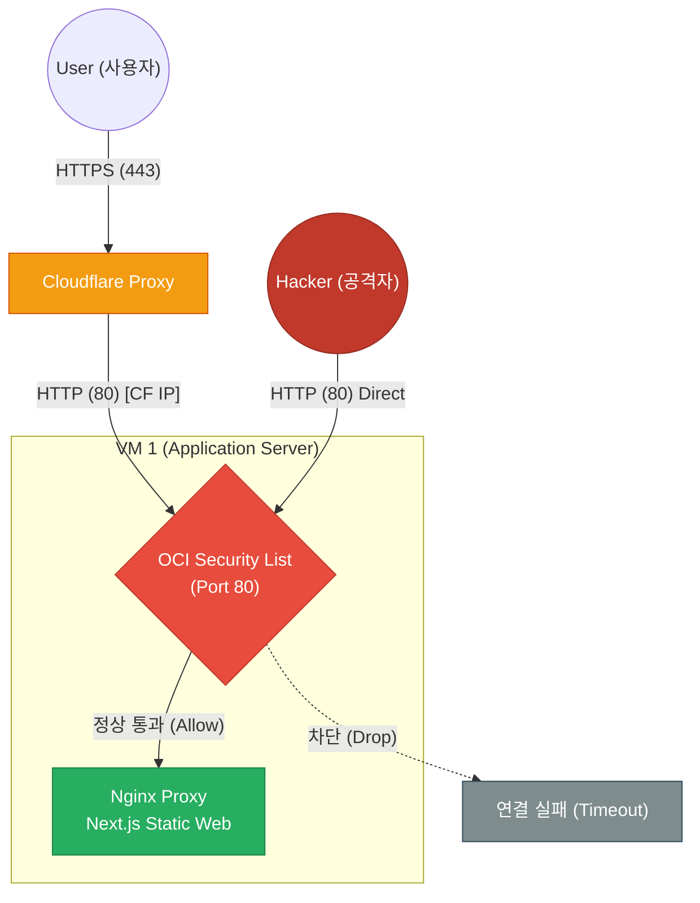

# 🔒 Cloudflare Flexible 모드 우회 및 헤더 스푸핑 방지 가이드

## 📌 개요 (Overview)

본 문서는 **Cloudflare Flexible SSL** 구조에서 발생할 수 있는 보안 취약점(우회 접속 및 헤더 스푸핑)의 발생 원인과 오라클 클라우드(OCI) 방화벽을 활용한 해결 방법을 정리합니다.

---

## 1. 문제 상황 및 보안 위협 (Problem)

두 취약점은 서로 밀접하게 연계되어 있으며, **1.1(우회)이 선행되어야만 1.2(헤더 조작) 공격이 성립하는 연쇄 관계**를 가집니다.

### 1.1 Cloudflare 보안 장벽 우회 (Bypass) - 1단계
*   **보안 위협:** 공격자가 도메인이 아닌 서버의 퍼블릭 IP(`http://140.238.xxx.xxx`)로 직접 포트 80에 요청을 보내면, Cloudflare의 DDoS 방어 및 웹 방화벽(WAF) 필터링 보안망이 통째로 무력화됩니다.


### 1.2 가짜 프로토콜 헤더 조작 (Header Spoofing) - 2단계
*   **보안 위협:** 공격자가 **1.1(우회 접속)에 성공한 상태**에서 HTTP 요청 헤더에 `X-Forwarded-Proto: https`를 직접 조작 및 주입해 전송할 경우, 백엔드(Spring Boot)가 실제 안전하지 않은 HTTP 요청임에도 불구하고 보안 HTTPS 연결로 완전히 속아 넘어가게 되는 취약점입니다. (정상적으로 Cloudflare를 거쳐 접속할 경우, Cloudflare가 헤더 변조를 강제로 차단 및 정화하므로 반드시 우회가 선행되어야 함)


---

## 2. 해결 방안 (Solution)


오라클 클라우드(OCI) 네트워크 방화벽 레벨에서 **오직 Cloudflare 공식 IP 대역들만 서버의 HTTP 80 포트에 접근할 수 있도록 강제 격리**합니다. 이외의 모든 IP 대역(공격자 직접 접속 등)은 원천 차단(Drop)됩니다.

### 📊 네트워크 격리 구조 (Network Security Topology)

<div style="max-width: 500px;">



</div>

---

## 3. 오라클 클라우드(OCI) 수신 규칙 설정 절차

1. **OCI 콘솔** 로그인 후 **Networking ➡️ Virtual Cloud Networks**로 이동합니다.
2. VM 1 인스턴스가 속한 **VCN**과 **보안 목록(Security List)**을 차례로 클릭합니다.
3. 기존에 모든 IP 대역을 허용하던 규칙(**소스:** `0.0.0.0/0`, **대상 포트:** `80`, **프로토콜:** `TCP`)을 찾아 **삭제(Remove)**합니다.
4. **수신 규칙 추가(Add Ingress Rules)**를 클릭하여 아래 **15개 Cloudflare 공식 IPv4 대역**을 각각 등록합니다.
   *   **소스 유형 (Source Type):** CIDR
   *   **소스 CIDR (Source CIDR):** `[Cloudflare IP 대역]` (예: `103.21.244.0/22`)
   *   **IP 프로토콜 (IP Protocol):** TCP
   *   **대상 포트 범위 (Destination Port Range):** `80`
   *   **설명 (Description):** `Cloudflare Ingress (80)`

### 📋 허용할 Cloudflare IPv4 대역 목록
*(최신 목록은 [Cloudflare IP Ranges](https://www.cloudflare.com/ips/)에서 실시간으로 조회가 가능합니다.)*
```text
103.21.244.0/22
103.22.200.0/22
103.31.4.0/22
104.16.0.0/13
104.24.0.0/14
108.162.192.0/18
131.0.72.0/22
141.101.64.0/18
162.158.0.0/15
172.64.0.0/13
173.245.48.0/20
188.114.96.0/20
190.93.240.0/20
197.234.240.0/22
198.41.128.0/17
```

---

## 4. 검증 및 결과 확인 (Verification)

*   **도메인 접속 (`https://relink.ai.kr`):** Cloudflare 서버를 거쳐서 진입하므로 **정상 접속 성공**.
*   **실제 IP 다이렉트 접속 (`http://140.238.xxx.xxx`):** OCI 방화벽 레벨에서 즉시 차단되므로 Nginx에 연결조차 되지 않고 **접속 제한 및 타임아웃 실패**.

---

## 5. ⚡ 추가 트러블슈팅: IP 화이트리스팅 적용 후 사이트가 너무 느려지는 현상

OCI 방화벽에 Cloudflare IP 화이트리스팅을 적용한 직후, 사이트 로딩 속도가 비정상적으로 느려지는 현상이 발생할 수 있습니다. 이는 OCI 방화벽 자체의 문제가 아니라 **네트워크/애플리케이션 계층의 병목 현상**이며, 원인과 해결법은 다음과 같습니다.

### 5.1 원인 분석
1. **가짜 IP로 인한 WAS(Tomcat) DNS 역조회 병목 (99% 확률):**
   * 방화벽 화이트리스팅 적용으로 모든 트래픽이 Cloudflare IP 대역을 거쳐 들어옵니다.
   * Nginx에 Cloudflare의 진짜 IP 식별 설정(`set_real_ip_from`)이 없거나 IP 대역 중 일부가 누락된 경우, WAS(Spring Boot Tomcat)는 모든 사용자의 IP를 Cloudflare 대표 IP(예: `162.158.x.x`)로 오인합니다.
   * Tomcat은 접속 로그를 기록하거나 보안 필터를 처리할 때 이 대표 IP들의 영문 호스트명을 알아내기 위해 **DNS 역방향 조회(Reverse DNS Lookup)**를 수행하며, 이때 네트워크 대기 지연(Timeout)이 발생해 화면 로딩이 2~5초 이상 지연됩니다.
2. **Cloudflare의 IPv6 연결 차단 대기 (Fallback 지연):**
   * Cloudflare는 도메인 접속 시 기본적으로 **IPv6**로 우선 접속을 시도합니다.
   * OCI 방화벽(수신 규칙)에 IPv4 대역만 열어놓고 IPv6 대역을 누락하면, Cloudflare가 OCI 서버로 IPv6 패킷을 쏘았을 때 OCI가 이를 응답 없이 차단(Drop)합니다.
   * Cloudflare는 타임아웃 대기 시간(1~2초)이 지난 후에야 IPv4로 우회(Fallback) 연결을 재시도하므로 페이지 내부의 수많은 리소스를 가져올 때마다 극심한 대기렉이 누적됩니다.

### 5.2 해결 방안

#### ✔️ 해결책 1: Nginx Real IP 복원 설정 적용 (WAS 병목 제거)
Nginx가 Cloudflare IP 뒤에 숨겨진 실제 사용자 접속 IP(`CF-Connecting-IP` 헤더)를 원본 IP로 정상 복원하여 WAS로 넘기도록 유도합니다.
* **적용 파일:** `nginx-prod.conf`
* **설정 코드:**
  ```nginx
  # Cloudflare 대역을 신뢰할 수 있는 프록시로 지정 (실제 사용중인 15개 대역 완벽 매칭)
  set_real_ip_from 103.21.244.0/22;
  set_real_ip_from 103.22.200.0/22;
  set_real_ip_from 103.31.4.0/22;
  set_real_ip_from 104.16.0.0/13;
  set_real_ip_from 104.24.0.0/14;
  set_real_ip_from 108.162.192.0/18;
  set_real_ip_from 131.0.72.0/22;
  set_real_ip_from 141.101.64.0/18;
  set_real_ip_from 162.158.0.0/15;
  set_real_ip_from 172.64.0.0/13;
  set_real_ip_from 173.245.48.0/20;
  set_real_ip_from 188.114.96.0/20;
  set_real_ip_from 190.93.240.0/20;
  set_real_ip_from 197.234.240.0/22;
  set_real_ip_from 198.41.128.0/17;
  
  # 진짜 IP가 담겨오는 Cloudflare 고유 헤더 지정
  real_ip_header CF-Connecting-IP;
  ```

#### ✔️ 해결책 2: Cloudflare IPv6 비활성화 또는 OCI 수신 규칙 추가 (IPv6 Fallback 제거)
* **방법 A (권장):** Cloudflare 웹 대시보드 ➡️ **Network** 메뉴로 접속하여 **IPv6 Compatibility (IPv6 호환성)** 설정을 **OFF**로 비활성화합니다. (가장 간단하고 확실하게 타임아웃 지연 제거)
* **방법 B:** OCI 보안 목록에 아래 **Cloudflare 공식 IPv6 대역 (7개)**을 TCP 80 포트 수신 허용 규칙으로 추가 등록해 줍니다.
  * `2400:cb00::/32`
  * `2606:4700::/32`
  * `2803:f800::/32`
  * `2405:b500::/32`
  * `2405:8100::/32`
  * `2a06:98c0::/29`
  * `2c0f:f248::/32`

